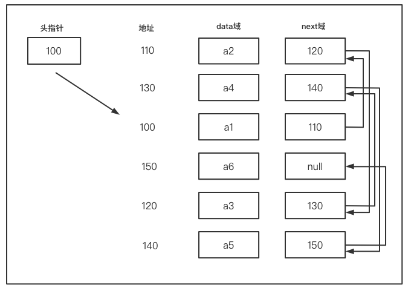
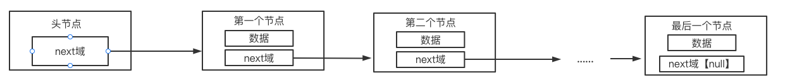
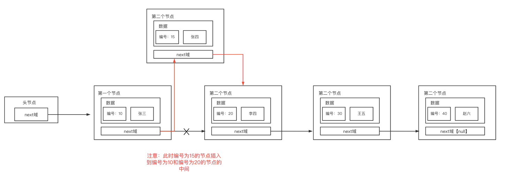
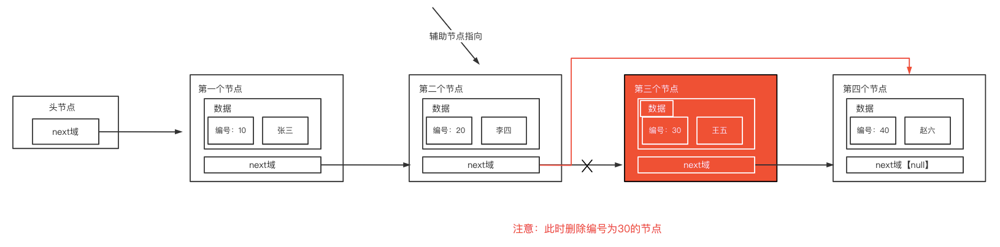
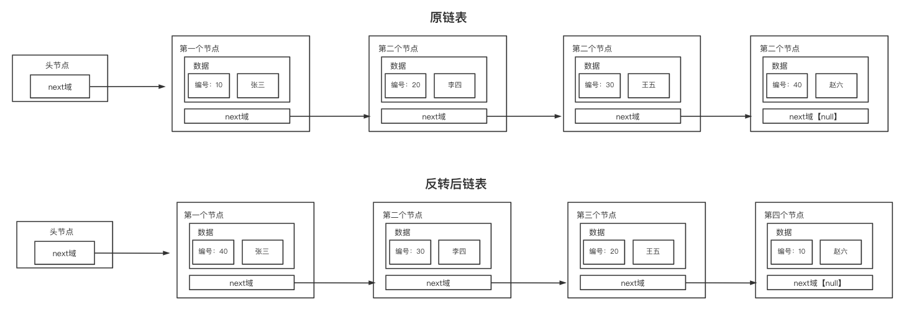
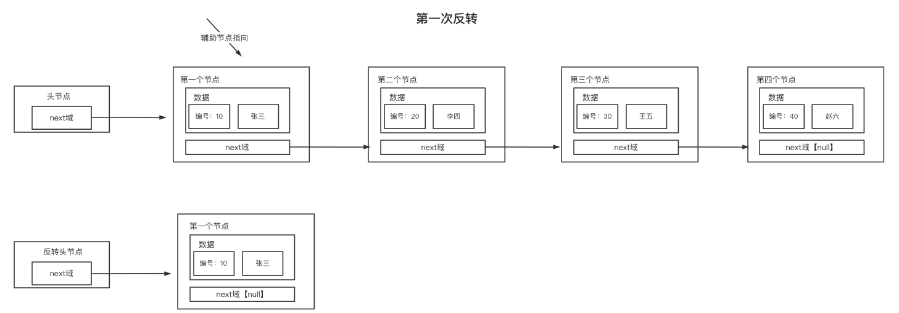
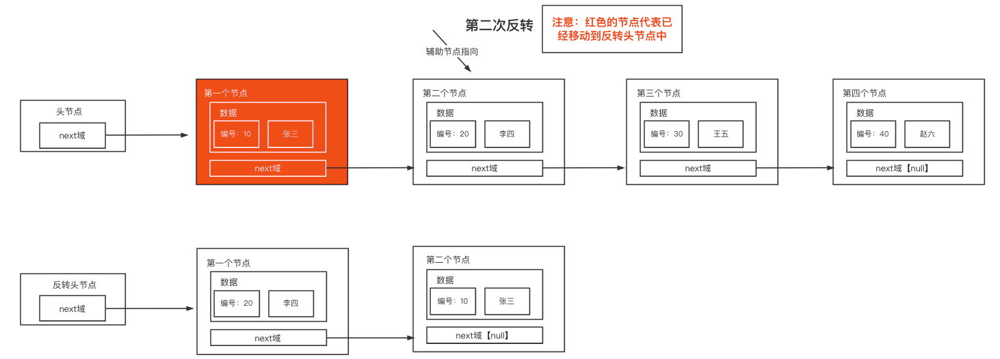
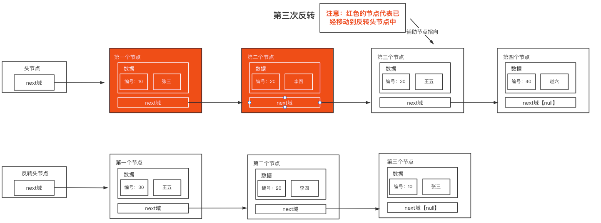
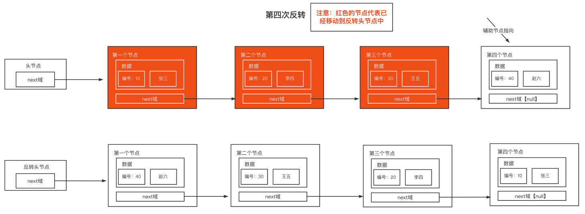
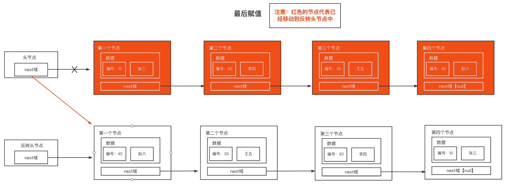

### 单链表（Single Linked List）

单链表是一个有序的列表，分为**带头节点的单链表**和**不带头节点的单链表**



如上图，会发现：

- 链表是以节点的方式来存储的
- 每个节点都包含data域、next域
- 并且每一个节点都不一定是连续的


#### 思路分析

头节点：不存放具体的数据，主要用于表示单链表的头，指向第一个节点



##### (一) 添加功能（未排序）

- 创建一个辅助节点，用于表示头节点
- 通过辅助节点找到最后节点的位置
- 将最后节点位置的next域指向新节点即可


##### (二) 遍历功能

- 当链表为空时，不能遍历链表
- 需要创建一个辅助节点，用于表示头节点
- 通过辅助节点的next域获取每一个节点的信息，当next域为空时，说明已经遍历所有


##### (三) 添加功能（编号排序）



- 首先需要创建一个辅助节点，用于表示头节点

- 通过辅助节点找到新节点的前一个节点的位置，这时有三种情况：

  - 已经到链表最后的位置
  - 在链表的某个位置中插入（未到链表的最后）
  - 插入的新节点的编号已经存在，那么新节点就不能插入

- 当找到前一个节点的位置后：

  - 获取前一个节点的next域，这个就是最后新节点的next域，并将这个next域赋值给新节点的next域，即 新节点.next = temp.next
  - 此时新节点的next域已经有指向了，现在只需要和前面的节点合在一起即可
  - 而temp就是指向新节点的前一个节点的位置，只需将temp的next域指向新节点即可，即 temp.next = 新节点


##### (四) 修改功能

- 首先需要创建一个辅助节点，用于表示头节点
- 要先通过辅助节点找到需要修改节点，此时有两种情况：
  - 辅助节点为空，即没有找到修改的节点
  - 辅助节点的编号和修改节点的编号相同，即找到修改的节点
- 此时，通过判断是否找到位置，有两种情况：
  - 没有找到修改的节点，输出对应的信息
  - 找到修改的节点，只需设置辅助节点的数据为修改节点的数据即可


##### (五) 删除功能



- 首先需要创建一个辅助节点，用于表示头节点
- 需要先通过辅助节点找到需要删除节点的前一个节点的位置，此时有两种情况：
  - 已经到链表的最后一个节点的位置，即没有找到需要删除的节点
  - 没有到链表的最后一个节点的位置，即找到需要删除的节点
- 此时，通过判断是否找到位置，有两种情况：
  - 没有找到删除的节点，输出对应的信息
  - 找到删除的节点，此时辅助节点指向删除节点的前一个节点，只需设置辅助节点的next域为删除节点的next域即可


#### 功能实现

##### (一) 创建节点（Node）类

用于每个节点的存储

```java
public class Node {
    private int no; // 编号
    private String name; // 名称
    private Node next; // next域，即下一个节点的指向

    public Node() {
    }

    public Node(int no, String name) {
        this.no = no;
        this.name = name;
    }

    public int getNo() {
        return no;
    }

    public void setNo(int no) {
        this.no = no;
    }

    public String getName() {
        return name;
    }

    public void setName(String name) {
        this.name = name;
    }

    public Node getNext() {
        return next;
    }

    public void setNext(Node next) {
        this.next = next;
    }

    @Override
    public String toString() {
        return "Node{" +
                "no=" + no +
                ", name='" + name + '\'' +
                '}';
    }
}
```


##### (二) 创建单链表（SingleLinkedList）类

```java
public class SingleLinkedList {

    // 1.初始化一个头节点
    private Node headNode = new Node();
}
```


##### (三) 添加功能（未排序）实现

在SingleLinkedList类中实现添加节点功能的方法（未排序）

```java
    // 2.添加节点
    // （一）不考虑编号的顺序，直接获取当前链表的最后节点
    // （二）直接将最后节点的next域指向新节点即可
    public void add(Node node){
        Node temp = headNode;
        // 1.遍历链表，找到最后节点
        while (true){
            // （一）找到当前链表最后一个，退出遍历
            if (temp.getNext() == null){
                break;
            }
            // （二）还没有找到当前链表的最后一个，将temp后移到下一个节点
            temp = temp.getNext();
        }

        // 2.将新节点添加到最后，将temp的next域指向新节点即可
        temp.setNext(node);
    }
```


##### (四) 遍历功能实现

在SingleLinkedList类中实现遍历节点功能的方法

```java
    // 3.遍历链表
    public void list(){
        // 1.判断链表为空
        if (headNode.getNext() == null){
            System.out.println("遍历链表list() --> 当前单链表为空");
            return;
        }

        Node temp = headNode;

        System.out.println("遍历链表list() ---> 开始遍历");

        // 2.遍历链表
        while (true){
            // 判断是否到链表的最后
            if (temp.getNext() == null){
                break;
            }

            System.out.println(temp.getNext());

            temp = temp.getNext();
        }

        System.out.println("遍历链表list() ---> 遍历结束");
    }
```


##### (五) 添加功能（编号排序）实现

在SingleLinkedList类中实现添加节点功能的方法（编号排序）

```java
    /**
     * 4.添加节点（考虑编号的顺序）
     * （一）插入新节点时，需要先使用辅助节点（temp）找到新节点的前一个节点的位置，这时有三种情况：
     *      1. 已经到链表最后的位置
     *      2. 在链表的某个位置中插入（未到链表的最后）
     *      3. 插入的新节点的编号已经存在，那么新节点就不能插入
     * （二）当找到前一个节点的位置后：
     *      1. 获取前一个节点的next域，这个就是最后新节点的next域，并将这个next域赋值给新节点的next域，即 新节点.next = temp.next
     *      2. 此时新节点的next域已经有指向了，现在只需要和前面的节点合在一起即可
     *      3. 而temp就是指向新节点的前一个节点的位置，只需将temp的next域指向新节点即可，即 temp.next = 新节点
     * @param node 新节点
     */
    public void addByOrder(Node node){

        Node temp = headNode;

        // 标识新节点的标号是否已经存在
        boolean flag = false;

        // 1.找到新节点的插入位置的前一个节点
        while (true){
            // (一) 说明已经在链表的最后位置
            if (temp.getNext() == null){
                break;
            }

            // （二）说明插入位置的前一个节点已经找到
            if (temp.getNext().getNo() > node.getNo()){
                break;
            }

            // （三）说明插入的新节点的编号已经在链表中插入
            if (temp.getNext().getNo() == node.getNo()){
                flag = true;
                break;
            }

            // （四）辅助节点后移
            temp = temp.getNext();
        }

        // 2.判断flag的值
        if (flag){
            System.out.println("添加节点addByOrder() ---> 添加的新节点已经存在");
            return;
        }

        // 3.插入新节点到链表中
        // （一）新节点的next域指向辅助节点的下一个节点
        node.setNext(temp.getNext());
        // （二）辅助节点的next域指向新节点
        temp.setNext(node);
    }
```


##### (六) 修改功能实现

在SingleLinkedList类中实现修改节点功能的方法

```java
    // 5.修改链表
    public void update(Node node){
        Node temp = headNode.getNext();

        // 标识是否找到修改的节点
        boolean flag = false;
        while (true){
            // 判断辅助节点是否为空，为空则说明当前已经在链表的最后位置，即链表中没有找到需要修改的节点
            if (temp == null){
                break;
            }

            // 判断编号是否相同，相同则说明找到修改的编号
            if (temp.getNo() == node.getNo()){
                flag = true;
                break;
            }

            // 辅助节点后移
            temp = temp.getNext();
        }

        // 根据flag判断是否找到需要修改的节点
        if (!flag){
            System.out.println("修改链表update ---> 当前修改编号为" + node.getNo() + "的节点不存在");
            return;
        }

        // 修改节点
        temp.setName(node.getName());

        System.out.println("修改链表update ---> 编号为" + node.getNo() + "的节点修改成功");
    }
```


##### (七) 删除功能实现

在SingleLinkedList类中实现删除节点功能的方法

```java
// 6.删除节点
public void delete(int no){
    Node temp = headNode;

    // 标识是否找到需要删除的节点
    boolean flag = false;

    while (true){
        // 判断辅助节点的next域是否为空，如果为空则说明已经是当前链表的最后一个节点，即没有找到需要删除的节点
        if (temp.getNext() == null){
            break;
        }

        // 判断辅助节点的next域的编号是否和删除的编号相同，相同则说明已经找到需要删除的节点
        if (temp.getNext().getNo() == no){
            flag = true;
            break;
        }

        // 辅助节点后移
        temp = temp.getNext();
    }

    // 判断flag是否为false，为false则说明没有找到需要删除的节点
    if (!flag){
        System.out.println("删除节点delete ---> 删除的节点" + no + "在链表中不存在");
        return;
    }

    // 辅助节点的next域指向需要需要修改节点的next域
    temp.setNext(temp.getNext().getNext());
}
```


#### 扩展

##### (一) 获取单链表中有效节点个数【没有头节点】

需要创建一个辅助节点，通过辅助节点进行循环操作，每次循环有效个数 + 1，循环结束后就可以获取到单链表的有效节点个数

```java
    // 获取单链表中有效节点个数
    public int getSize(){
        // 判断头节点的next域是否为空，为空则说明当前链表中没有节点
        if (headNode.getNext() == null){
            return 0;
        }

        // 链表的有效个数
        int size = 0;
        // 获取辅助节点
        Node temp = headNode.getNext();

        // 循环获取有效个数，当辅助节点为空时，说明当前循环结束，链表的有效个数已经获取到
        while (temp != null){
            // 每次循环有效个数 + 1
            size++;
            // 辅助节点后移
            temp = temp.getNext();
        }
        return size;
    }
```


##### (二) 获取单链表倒数第n个节点

通过 （有效节点数 - n），可以获取倒数第n个节点的位置

```java
    // 获取单链表倒数第n个节点
    public Node getNodeByLastIndexNote(int index){
        // 判断头节点的next域是否为空，为空则说明当前链表中没有节点
        if (headNode.getNext() == null){
            return null;
        }

        // 获取当前链表中的有效节点个数
        int size = getSize();

        // 判断输入的位置是否小于等于0或大于链表的有效节点个数
        if (index <= 0 || index > size){
            return null;
        }

        Node temp = headNode.getNext();

        // 通过 （有效节点个数 - 输入的位置）得到倒数第n个的位置，循环获取到的位置即可
        for (int i = 0; i < size - index; i++) {
            temp = temp.getNext();
        }

        return temp;
    }
```


##### (三) 单链表反转

###### 实现效果



###### 实现过程

**（一）第一次反转**



**（二）第二次反转**



**（三）第三次反转**



**（四）第四次反转**



**（五）赋值给头节点**



###### 思路分析

- 当链表为空或者只有一个节点时，不需要任何操作
- 创建一个辅助节点（temp），用于遍历链表
- 创建一个下一个节点（nextNode），用于在遍历中指向下一个遍历的节点
- 创建一个反转头节点（reverseHead），用于作为反转后的头节点
- 循环遍历链表
  - 将下一次循环的节点赋值给nextNode
  - **将当前辅助节点（temp）中的next域指向反转头节点中的next域**
  - **将反转头节点的next域指向当前辅助节点（temp），此时反转头节点中的第一个节点为当前辅助节点**
  - 辅助节点（temp）后移，即将nextNode再次赋值给辅助节点（temp）

-  将原先链表中的头节点的next域指向反转头节点的next域即可


###### 功能实现

```java
    // 单链表反转
    public void reverseNode(){
        // 判断链表是否为空或者只有一个节点，如果链表为空或者只有一个节点则无需做任何操作
        if (headNode.getNext() == null || headNode.getNext().getNext() == null){
            return;
        }

        // 辅助指针，用于遍历整个链表
        Node temp = headNode.getNext();
        // 指向当前辅助指针的下一个节点
        Node nextNode = null;
        // 反转链表的head节点
        Node reverseHead = new Node();

        while (temp != null){
            // 将下一个节点赋值给nextNode
            nextNode = temp.getNext();

            // 将当前辅助节点的next域指向反转链表的第一个节点
            // 1.将原反转链表的第一个节点赋值给当前辅助节点的next域
            temp.setNext(reverseHead.getNext());
            // 2.反转链表的头节点指向辅助节点，即可为反转链表中的第一个节点
            reverseHead.setNext(temp);

            // 辅助节点后移
            temp = nextNode;
        }

        // 将反转后的节点在赋值给headNode
        headNode.setNext(reverseHead.getNext());
    }
```


##### (四) 从尾到头打印单链表

方式一：可以先将单链表进行反转，然后在遍历即可，但是这种解决方式会破坏原先单链表的结构【不推荐】

方式二：可以利用栈（stack）这个数据结构，利用栈的先进后出的特点，将各个节点压入栈中，就可以实现从尾到头打印的效果


使用栈的方式实现：

```java
// 从尾到头打印单链表
public void reversePPrint(){
    if (headNode.getNext() == null){
        return;
    }

    // 创建一个栈
    Stack<Node> nodeStack = new Stack<>();

    Node temp = headNode.getNext();
    // 将各个节点压入到栈中
    while (temp != null){
        nodeStack.push(temp);
        temp = temp.getNext();
    }

    // 将各个节点出栈
    while (nodeStack.size() > 0){
        System.out.println(nodeStack.pop());
    }
}
```


##### (五) 合并两个有序的单链表，合并后仍然有序

###### 方法一

```java
    public static SingleLinkedList mergeNode(SingleLinkedList head1, SingleLinkedList head2){
        // 判断合并的两个链表是否为空
        if (head1 == null && head2 == null){
            return null;
        }

        // 判断合并的两个链表是否其中一个为空，其中一个为空则返回其中不为空的链表
        if (head1 == null || head2 == null){
            return head1 == null ? head2 : head1;
        }

        // 创建合并后的链表
        SingleLinkedList newList = new SingleLinkedList();
        // 创建合并链表的辅助指针
        Node newListTemp = newList.headNode;

        // 创建两个单链表的辅助指针
        Node head1Temp = head1.headNode.getNext();
        Node head2Temp = head2.headNode.getNext();

        while (head1Temp != null){
            while (head2Temp != null){
                // 判断链表1的编号是否比链表2的编号大，如果是则将当前链表2中的节点加入到合并后的链表中
                if (head1Temp.getNo() >= head2Temp.getNo()){
                    // 记录当前链表2的下一个节点
                    Node head2NextNode = head2Temp.getNext();

                    // 将当前链表2中的节点插入到合并后的链表中
                    newListTemp.setNext(head2Temp);
                    // 合并链表的辅助指针后移
                    newListTemp = newListTemp.getNext();

                    // 链表2的辅助指针后移
                    head2Temp = head2NextNode;
                    continue;
                }
                break;
            }

            // 记录当前链表1的下一个节点
            Node head1NextNode = head1Temp.getNext();
            // 将当前链表1中的节点插入到合并后的链表中
            newListTemp.setNext(head1Temp);
            // 合并链表的辅助指针后移
            newListTemp = newListTemp.getNext();

            // 链表1的辅助指针后移
            head1Temp = head1NextNode;
        }

        // 判断链表2中是否还存在节点
        //  1.存在，则说明链表1中的所有节点编号比链表2的节点编号小，需要将链表2中剩余的节点插入到合并链表中
        //  2.不存在，则说明链表1中的所有节点编号比链表的节点编号大，并且已经将链表1和链表2中的所有节点插入到合并链表中
        if (head2Temp != null){
            // 将链表2中剩余的节点插入到合并链表中
            newList.add(head2Temp);
        }

        return newList;
    }
```


###### 方法二

```java
public static SingleLinkedList mergeNode(SingleLinkedList list1, SingleLinkedList list2){
    // 判断合并的两个链表是否为空
    if (list1 == null && list2 == null){
        return null;
    }

    // 判断合并的两个链表是否其中一个为空，其中一个为空则返回其中不为空的链表
    if (list1 == null || list2 == null){
        return list1 == null ? list2 : list1;
    }

    // 获取两个有序单链表的第一个节点
    Node head1 = list1.headNode.getNext();
    Node head2 = list2.headNode.getNext();

    // 创建合并后的节点
    Node node = null;

    // 判断两个有序单链表的第一个节点的大小
    if (head1.getNo() > head2.getNo()){
        // 将第一个节点放入合并后节点中
        node = head2;
        // 节点后移
        head2 = head2.getNext();
    }else {
        // 将第一个节点放入合并后节点中 
        node = head1;
        // 节点后移
        head1 = head1.getNext();
    }

    // 创建合并后节点的辅助指针
    Node temp = node;

    // 循环比较两个链表节点的大小
    while (head1 != null && head2 != null){
        // 比较链表1的节点是否比链表2的节点大
        if (head1.getNo() > head2.getNo()){ // 链表1的节点比链表2的节点大
            temp.setNext(head2);    // 将链表2的节点存入合并后节点的末尾
            temp = temp.getNext();  // 辅助指针后移
            head2 = head2.getNext();// 链表2的节点后移
        }else { // 链表1的节点比链表2的节点小
            temp.setNext(head1);    // 将链表1的节点存入合并后节点的末尾
            temp = temp.getNext();  // 辅助指针后移
            head1 = head1.getNext();// 链表1的节点后移
        }
    }

    // 判断两个有序链表是否有剩余的节点，存在剩余的节点则将剩余的节点存入合并后节点的末尾
    if (head1 != null){
        temp.setNext(head1);
    }else {
        temp.setNext(head2);
    }

    // 创建空链表
    SingleLinkedList newLinkedList = new SingleLinkedList();
    // 将空链表的头节点的下一个指向为合并后节点的第一个节点
    newLinkedList.headNode.setNext(node);
    
    return newLinkedList;
}
```
