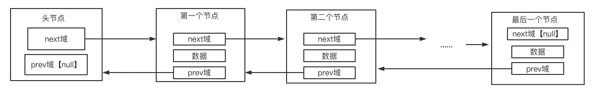

### 双向链表

#### 单链表存在的缺点

- 单链表中，查找的方向只能是一个方向
- 单链表不能实现自我删除，需要靠辅助节点来实现

而双向链表可以解决以上两种缺点


#### 双向链表介绍

双向链表是在单链表的基础上添加了一个新的域：prev，即指向前一个节点的指向



#### 思路分析

##### (一) 添加功能，添加到双向链表的末尾

- 需要创建一个辅助指针，用于循环遍历
- 循环遍历到当前链表的最后一个节点
- 设置最后一个节点的next域
- 设置新加入节点的prev域


##### (二) 删除功能

- 当链表为空时，无需任何操作
- 需要创建一个辅助指针，用于循环遍历
- 循环遍历查找要删除的节点
- 设置删除节点的前一个节点的next域为删除节点的下一个节点
- 设置删除节点的下一个节点的prev域为删除节点的前一个节点


##### (三) 修改功能

- 当链表为空时，无需任何操作
- 需要创建一个辅助指针，用于循环遍历
- 循环遍历查找要修改的节点
- 修改数据


#### 代码实现

创建节点类（Node）

```java
package com.lcxuan.linear.linkedList.double_;

public class Node {
    private int no;
    private String name;
    private Node prev;
    private Node next;

    public Node() {
    }

    public Node(int no, String name) {
        this.no = no;
        this.name = name;
    }

    public int getNo() {
        return no;
    }

    public void setNo(int no) {
        this.no = no;
    }

    public String getName() {
        return name;
    }

    public void setName(String name) {
        this.name = name;
    }

    public Node getPrev() {
        return prev;
    }

    public void setPrev(Node prev) {
        this.prev = prev;
    }

    public Node getNext() {
        return next;
    }

    public void setNext(Node next) {
        this.next = next;
    }

    @Override
    public String toString() {
        return "Node{" +
                "no=" + no +
                ", name='" + name + '\'' +
                '}';
    }
}
```

实现双向链表（DoubleLinkedList）

```java
public class DoubleLinkedList {
    private Node headNode = new Node();
}
```


##### (一) 添加功能，添加到双向链表的末尾

```java
    /**
     * 添加节点（添加到双向链表的最后）
     * @param node
     */
    public void addByLast(Node node){
        // 创建辅助指针
        Node temp = headNode;

        // 循环获取当前链表的最后一个节点
        while (true){
            if (temp.getNext() == null){
                break;
            }
            temp = temp.getNext();
        }

        // 将当前链表的最后一个节点的next域指向新加的节点
        temp.setNext(node);
        // 将新加节点的prev域指向当前链表的最后一个节点
        node.setPrev(temp);
    }
```


##### (二) 删除功能

```java
/**
 * 删除节点
 * @param no 删除节点的编号
 */
public void delete(int no){
    if (headNode.getNext() == null){
        System.out.println("修改链表update ---> 当前链表为空");
        return;
    }

    // 创建辅助指针
    Node temp = headNode.getNext();
    // 创建标识，用于表示是否找到需要删除的节点
    boolean flag = false;
    // 循环查找需要删除的节点
    while (temp != null){
        if (temp.getNo() == no){
            flag = true;
            break;
        }
        temp = temp.getNext();
    }

    // 判断标识是否为false，为false说明没有找到需要删除的节点
    if (!flag){
        System.out.println("删除链表delete ---> 删除的" + no + "编号不存在");
        return;
    }

    // 将要删除节点的前一个节点指向要删除节点的下一个节点
    temp.getPrev().setNext(temp.getNext());

    // 判断查找到要删除节点的下一个节点是否为null，为null则说明已经是当前链表的最后一个
    if (temp.getNext() != null){
        // 将要删除节点的下一个节点指向要删除节点的前一个节点
        temp.getNext().setPrev(temp.getPrev());
    }
}
```


##### (三) 修改功能

```java
    /**
     * 修改节点
     * @param node 修改的节点
     */
    public void update(Node node){
        // 判断当亲啊链表是否为空
        if (headNode.getNext() == null){
            System.out.println("修改链表update ---> 当前链表为空");
            return;
        }

        // 创建辅助指针
        Node temp = headNode.getNext();
        // 创建标识，用于表示是否找到需要修改的节点
        boolean flag = false;
        // 循环查找需要修改的节点
        while (temp != null){
            if (temp.getNo() == node.getNo()){
                flag = true;
                break;
            }
            temp = temp.getNext();
        }

        // 判断标识是否为false，为false说明没有找到需要修改的节点
        if (!flag){
            System.out.println("修改链表update ---> 修改的" + node.getNo() + "编号不存在");
            return;
        }
        temp.setName(node.getName());
    }
```


#### 扩展

##### (一) 添加功能，按照编号添加

```java
public void addByOrder(Node node){
    
    // 辅助指针
    Node temp = headNode;

    // 创建标识，用于查找是否存在编号相同的节点
    boolean flag = false;
    
    // 循环遍历需要添加编号的前一个节点
    while (temp.getNext() != null){

        // 判断是否编号相同
        if (temp.getNext().getNo() == node.getNo()){
            flag = true;
            break;
        }

        // 判断是否比新添加节点的编号大
        if (temp.getNext().getNo() > node.getNo()){
            break;
        }

        temp = temp.getNext();
    }

    // 判断标识是否为true，为true则说明当前编号已经存在
    if (flag){
        System.out.println("当前添加的编号为" + node.getNo() + "的节点已经存在");
        return;
    }

    // 判断辅助指针的下一个节点是否为null，为null则说明已经在链表的最后一个节点的位置
    if (temp.getNext() != null){
        node.setPrev(temp);
        node.setNext(temp.getNext());
        temp.getNext().setPrev(temp);
        temp.setNext(node);
    }else {
        temp.setNext(node);
        node.setPrev(temp);
    }
}
```


##### (二) 合并两个有序链表，并且合并后还是有序的

```java
public static DoubleLinkedList merge(DoubleLinkedList list1, DoubleLinkedList list2){

    // 获取两个链表的第一个节点
    Node node1 = list1.headNode.getNext();
    Node node2 = list2.headNode.getNext();

    // 判断两个链表的第一个节点是否都为null
    if (node1 == null && node2 == null){
        return null;
    }

    // 判断两个链表的第一个节点是否有其中一个为null
    if (node1 == null || node2 == null){
        return node1 == null ? list2 : list1;
    }

    // 创建合并后的节点
    Node newNode = null;
    
    // 判断链表1和链表2的第一个节点的大小
    if (node1.getNo() > node2.getNo()){ // 链表1第一个节点比链表2第一个节点大
        newNode = node2;
        node2 = node2.getNext();
    }else { // 链表1第一个节点比链表2第一个节点小
        newNode = node1;
        node1 = node1.getNext();
    }

    // 创建辅助节点
    Node temp = newNode;

    // 循环遍历链表1和链表2中各个节点的大小
    while (node1 != null && node2 != null){
        // 判断链表1是否大于链表2中的节点
        if (node1.getNo() > node2.getNo()){
            temp.setNext(node2);
            node2.setPrev(temp);
            temp = temp.getNext();
            node2 = node2.getNext();
        }else {
            temp.setNext(node1);
            node1.setPrev(temp);
            temp = temp.getNext();
            node1 = node1.getNext();
        }
    }

    // 判断链表1和链表2中的节点是否有剩余
    if (node1 != null){
        temp.setNext(node1);
        node1.setPrev(temp);
    }else {
        temp.setNext(node2);
        node2.setPrev(temp);
    }

    // 创建新链表，并设置头节点的指向
    DoubleLinkedList linkedList = new DoubleLinkedList();
    linkedList.headNode.setNext(newNode);
    newNode.setPrev(linkedList.headNode);

    return linkedList;
}
```