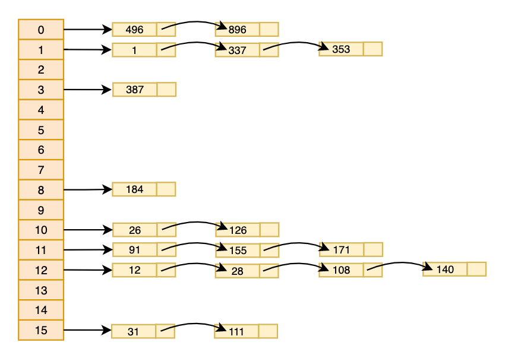

### 哈希表（Hash table）

哈希表，也称为散列表，是根据关键码值(Key value)而直接进行访问的数据结构。

也就是说，它通过把关键码值映射到表中一个位置来访问记录，以加快查找的速度。**这个映射函数叫做散列函数**，存放记录的数组叫做散列表

Java中的HashMap、HashTable就是基于哈希表来实现的

哈希表常用于解决快速查找数据的问题，时间复杂度接近于O(1)


#### 思路分析

数组的特点：寻址容易，插入和删除较难

链表的特点：寻址困难，插入和删除容易

根据以上数组和链表的特点，结合两个的特点，就可以实现一种寻址、插入和删除都容易的数据结构，即哈希表，也可以理解成"链表的数组"



> 根据上图，橙色的为数组，黄色的为链表


#### 代码实现

##### 创建节点类Emp.java

```java
public class Emp {
    private int id;
    private String name;
    private Emp next;

    public Emp() {
    }

    public Emp(int id, String name) {
        this.id = id;
        this.name = name;
    }
  
  	// 省略get和set方法
  
  	@Override
    public String toString() {
        return "Emp{" +
                "id=" + id +
                ", name='" + name + '\'' +
                '}';
    }
}
```

##### 创建链表类EmpLinkedList.java

```java
public class EmpLinkedList {

    // 创建头节点，头节点就是第一个节点
    private Emp head;

    // 根据id删除员工
    public int removeById(int id){
        // 判断链表是否为空
        if (head == null){
            System.out.println("删除id为" + id + "的链表为空！！！");
            return -1;
        }

        // 删除员工，即next指向改变
        Emp temp = head;
        while (true){
            if (temp.getNext() == null){
                break;
            }

            if (temp.getNext().getId() == id){
                temp.setNext(temp.getNext().getNext());
            }
        }

        return id;
    }

    // 根据id查找员工
    public Emp findEmpById(int id){
        // 判断链表是否为空
        if (head == null){
            System.out.println("查询的id为" + id + "的链表为空！！！");
            return null;
        }

        Emp temp = head;
        while (true){
            if (temp.getId() == id){
                break;
            }
            if (temp.getNext() == null){
                temp = null;
                break;
            }
            temp = temp.getNext();
        }
        return temp;
    }

    // 添加员工到链表最后
    public void add(Emp emp){
        // 判断链表是否为空
        if (head == null){
            head = emp;
            return;
        }

        Emp temp = head;
        while (temp.getNext() != null){
            temp = temp.getNext();
        }
        temp.setNext(emp);
    }

    // 遍历链表
    public void list(int no){
        if (head == null){
            System.out.println("第" + (no + 1) + "个链表为空！！！");
            return;
        }

        Emp temp = head;

        System.out.print("第" + (no + 1) + "个链表信息：");

        while (true){
            System.out.print(temp + "，\t");
            if (temp.getNext() == null){
                break;
            }
            temp = temp.getNext();
        }
        System.out.println();
    }
}
```

##### 创建哈希表

```java
public class HashTable {

    private EmpLinkedList[] empLinkedListArray;
    private int size;

    public HashTable(int size) {
        this.size = size;
        this.empLinkedListArray = new EmpLinkedList[size];

        // 循环创建空链表
        for (int i = 0; i < empLinkedListArray.length; i++) {
            empLinkedListArray[i] = new EmpLinkedList();
        }
    }

    // 根据id删除员工
    public void removeEmpById(int id){
        // 根据id，获取对应链表的下标
        int empLinkedListArrayNo = hashFun(id);
        int empId = empLinkedListArray[empLinkedListArrayNo].removeById(id);
        if (empId != -1){
            System.out.println("第" + empLinkedListArrayNo + "条链表中删除id为" + empId + "的信息");
        }
    }

    // 根据id查找员工
    public void findEmpById(int id){
        // 根据id，获取对应链表的下标
        int empLinkedListArrayNo = hashFun(id);
        Emp emp = empLinkedListArray[empLinkedListArrayNo].findEmpById(id);
        if (emp != null) {
            System.out.println("第" + empLinkedListArrayNo + "条链表中查找到id为" + id + "的信息：" + emp);
        }else {
            System.out.println("第" + empLinkedListArrayNo + "条链表中没有查找到id为" + id + "的信息！！！");
        }
    }

    // 查询所有链表中的员工信息
    public void list(){
        for (int i = 0; i < empLinkedListArray.length; i++) {
            empLinkedListArray[i].list(i);
        }
    }

    // 添加员工
    public void addEmp(Emp emp){
        // 根据id，获取对应链表的下标
        int empLinkedListNo = hashFun(emp.getId());
        // 将员工添加到对应的链表中
        empLinkedListArray[empLinkedListNo].add(emp);
    }

    // 创建散列函数，计算出对应的数组下标
    public int hashFun(int id){
        return id % size;
    }
}
```

