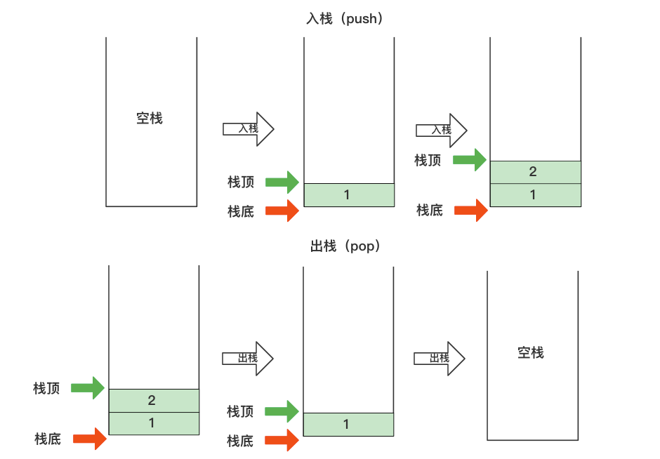
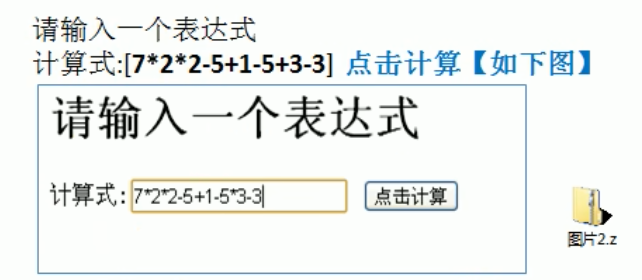
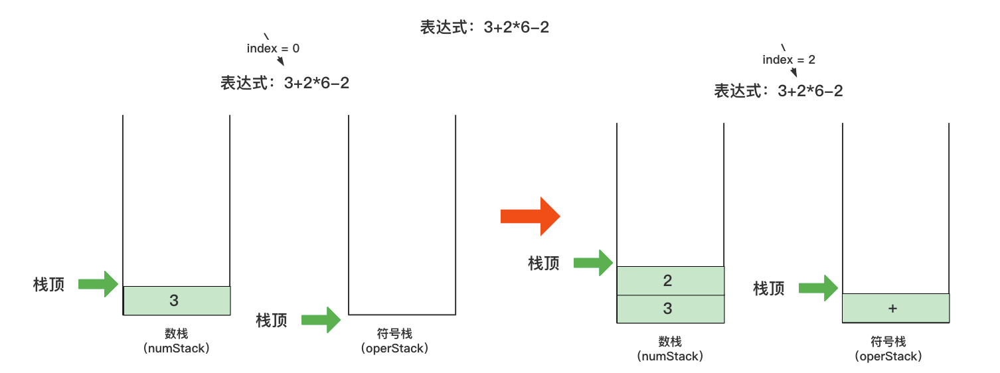
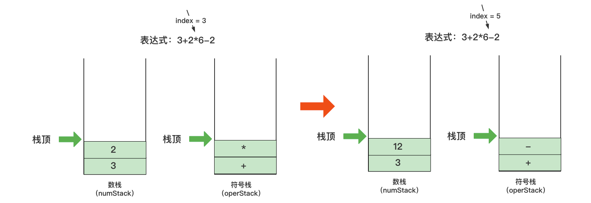
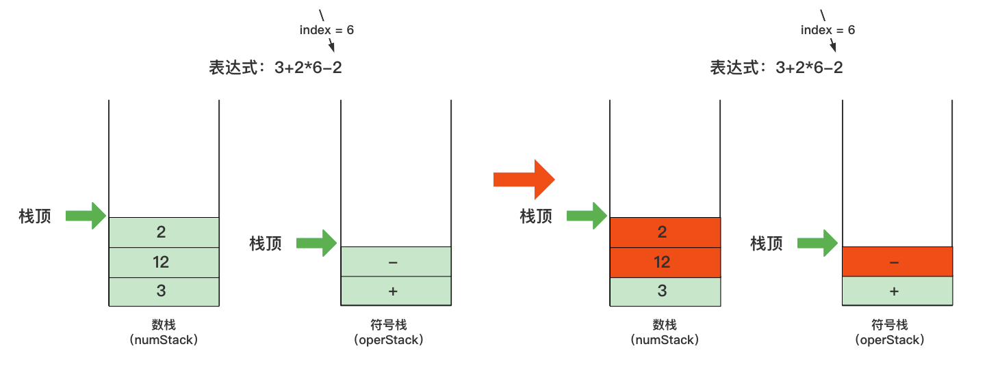
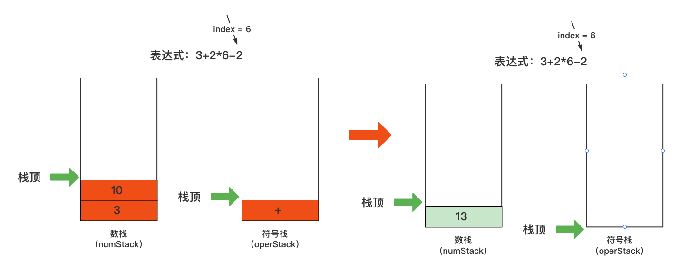
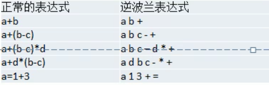

### 栈（Stack）

栈是一种**先进后出**（FILO-First In Last Out）的有序列表

限制线性表中元素的插入和删除只能在线性表的同一端进行的一种特殊线性表

允许插入和删除的一端，称为栈顶，另一端为固定的一端，称为栈底

所以，根据栈的定义，可得：

- 添加元素：最先放入栈中的元素在栈底，最后放入栈中的元素在栈顶
- 删除元素：最后放入栈中的元素最先删除，最先放入栈中的元素最后删除




#### 栈的应用场景

- 子程序的调用：在前往子程序前，先将下个指令的地址存到堆栈中，直到子程序执行完后再将地址取出，以回到原来的程序中
- 处理递归调用：和子程序的调用类似，只是除了存储下个指令的地址外，还将参数、区域变量等数据存入堆栈中
- 表达式的转换【中缀表达式转后缀表达式】与求值
- 二叉树的遍历
- 图形的深度优先（depth-first）搜索法


#### 使用数组实现栈的思路分析

- 定义一个maxSize变量，用来表示当前栈中最大的存储容量
- 定义一个top指针来表示栈顶，初始化为 -1
- 入栈时，top++，然后将对应的数据加入到栈中
- 出栈时，需要使用一个临时变量存储栈顶的第一个数据，top--，然后返回临时变量即可

```java
// 使用数组实现栈
public class ArrayStack {
    private int maxSize;    // 栈的最大存储熔容量
    private int[] stack;    // 数据放入数据中
    private int top = -1;   // 栈顶，初始化为-1，表示没有数据

    public ArrayStack(int maxSize) {
        this.maxSize = maxSize;
        // 初始化stack数组
        stack = new int[maxSize];
    }

    // 判断栈是否已满
    public boolean isFull(){
        return top == maxSize - 1;
    }

    // 判断栈是否为空
    public boolean isEmpty(){
        return top == -1;
    }

    // 入栈操作
    public void push(int value){
        // 判断栈是否已满
        if (isFull()){
            System.out.println("当前栈已满");
            return;
        }
        top++;
        stack[top] = value;
    }

    // 出栈操作
    public int pop(){
        if (isEmpty()){
            throw new RuntimeException("当前栈为空");
        }

        return stack[top--];
    }

    // 遍历栈
    public void list(){
        if (isEmpty()){
            System.out.println("当前栈为空");
            return;
        }

        for (int i = top; i > -1; i--) {
            System.out.println("当前栈顶前" + (i + 1) + "个值为：" + stack[i]);
        }
    }
}
```


#### 使用链表实现栈的思路分析

- 定义一个节点（Node）类，用于表示每个栈中存储的数据
- 定义一个头节点，用于表示头节点，但不做任何操作
- 入栈时，将数据插入到一个新节点中，然后将节点插入到头节点的next域，并且新节点的next域要指向原先头节点的next域
- 出栈时，将出栈的节点放入到一个临时变量中，头节点的next域指向出栈节点的next域，最后将数据返回即可

```java
// 使用链表实现栈
public class SingleLinkedListStack {

    private Node headNode = new Node();

    // 判断当前栈是否为空
    public boolean isEmpty(){
        return headNode.getNext() == null;
    }

    // 入栈操作
    public void push(int value){
        Node node = new Node(value);

        node.setNext(headNode.getNext());
        headNode.setNext(node);
    }

    // 出栈操作
    public int pop(){
        if (isEmpty()){
            throw new RuntimeException("当前栈为空");
        }

        Node temp = headNode.getNext();
        headNode.setNext(headNode.getNext().getNext());
        return temp.getNo();
    }

    // 遍历栈
    public void list(){
        Node temp = headNode.getNext();

        while (temp != null){
            System.out.println("遍历 ---> " + temp.getNo());
            temp = temp.getNext();
        }
    }
}
```


#### 实际需求：综合计算器



此时，传入的计算式是一个字符串，而不是单个的数字和符号，但需要计算整一个表达式，就可以使用栈来解决


##### 思路分析

- 通过一个index值，来遍历表达式
- 需要准备两个栈
  - 数栈（numStack）：用来存放数字
  - 符号栈（operStack）：用来存放操作符
- 当遍历表达式时
  - 如果是一个数字，那么将数字直接入栈到numStack中
  - 如果是一个符号，有以下情况
    - 如果当前operStack为空，那么直接将符号入栈
    - 如果当前operStack中有操作符，并且**当前操作符的优先级小于或者等于栈中的操作符**，则先从numStack中出栈两个数字，在operStack中出栈一个符号，进行运算，将得到的结果入栈到numStack中，然后将当前的操作符入栈到operStack中
    - 如果当前operStack中有操作符，并且**当前操作符的优先级大于栈中的操作符**，则直接入栈到operStack中
- 当表达式遍历完后，则顺序从numStack和operStack中出栈相应的数字和符号，并进行运算，将得到的结果入栈到numStack中
- 当最后numStack中只有一个数字，则这个数字就是表达式的结果









##### 代码实现（中缀表达式）

创建工具类CalculatorUtils，用于获取操作符的优先级，判断是否是操作符、计算结果

```java
public class CalculatorUtils {
    // 获取操作符的优先级
    // 此时只假设只有 + - * / 四个操作符
    public static int operatorPriority(int operator) {
        if (operator == '*' || operator == '/'){
            return 1;
        }else if (operator == '+' || operator == '-'){
            return 0;
        }else {
            return -1;
        }
    }

    // 判断是否是操作符
    public static boolean isOperator(int value) {
        return value == '+' || value == '-' || value == '*' || value == '/';
    }

    // 计算结果
    public static int calculator(int num1, int num2, int operator) {
        int result = 0;
        switch (operator){
            case '+':
                result = num1 + num2;
                break;
            case '-':
                result = num1 - num2;
                break;
            case '*':
                result = num1 * num2;
                break;
            case '/':
                result = num1 / num2;
                break;
        }
        return result;
    }
}
```

数字是只有一个时，即：数字个数只有一个，例如：3+2*6-2

```java
public class Calculator {

    public static void main(String[] args) {
        //String expression = "3+2*6-2";
        String expression = "7*2*2-5+1-5+3-4";

        // 创建两个栈：数栈和符号栈
        ArrayStack numStack = new ArrayStack(10);
        ArrayStack operStack = new ArrayStack(10);

        // 创建index，用于表示扫描表达式的下标
        int index = 0;

        // 创建两个存储计算数字的变量、存储单个操作符的变量和存储计算后结果的变量
        int num1 = 0;
        int num2 = 0;
        int operator = 0;
        int result = 0;

        // 用于获取表达式中每个字符
        char ch = ' ';

        while (index < expression.length()){
            // 依次获取表达式的每个字符
            ch = expression.charAt(index);

            // 判断获取的字符是数字还是符号
            if (CalculatorUtils.isOperator(ch)){ // 是符号
                if (!operStack.isEmpty()){  // 判断符号栈是否为空
                    if (CalculatorUtils.operatorPriority(ch) <= CalculatorUtils.operatorPriority(operStack.getTop())){  // 判断当前符号的优先级是否小于等于符号栈中的优先级
                        // 从两个栈中获取操作符和两位数字
                        operator = operStack.pop();
                        num2 = numStack.pop();
                        num1 = numStack.pop();

                        // 计算结果
                        result = CalculatorUtils.calculator(num1, num2, operator);

                        // 将结果放入数栈中
                        numStack.push(result);
                        // 将当前操作符放入符号栈中
                        operStack.push(ch);
                    }else { // 否则当前符号大于符号栈中的优先则直接放入到符号栈中
                        operStack.push(ch);
                    }
                }else {
                    operStack.push(ch);
                }
            }else { // 是数字
                // 由于类型是Char，而实际需要存储的是数字，所以需要在原先字符上
                numStack.push(((int) ch) - '0');
            }
            index++;
        }

        // 当表达式扫描完后，开始计算最终值，当符号栈为空时，说明当前表达式的最终结果已经计算完毕
        while (!operStack.isEmpty()){
            // 从两个栈中获取操作符和两位数字
            operator = operStack.pop();
            num2 = numStack.pop();
            num1 = numStack.pop();

            // 计算结果
            result = CalculatorUtils.calculator(num1, num2, operator);
            // 将结果放入数栈中
            numStack.push(result);
        }

        // 最终结果在数栈的栈顶上
        System.out.println("表达式：" + expression + "，最后结果：" + numStack.pop());
    }

}
```

**注意：此时，输入多个数字时，会出现问题，例如输入：700+2*6-4**

解决方法：需要修改当前表达式的字符是数字时放入数栈中的方式即可

```java
public class Calculator {

    public static void main(String[] args) {
        //String expression = "3+2*6-2";
        //String expression = "700+2*6-4";
        String expression = "7*2*2-5+1-5+3-4";

        // 创建两个栈：数栈和符号栈
        ArrayStack numStack = new ArrayStack(10);
        ArrayStack operStack = new ArrayStack(10);

        // 创建index，用于表示扫描表达式的下标
        int index = 0;

        // 创建两个存储计算数字的变量、存储单个操作符的变量和存储计算后结果的变量
        int num1 = 0;
        int num2 = 0;
        int operator = 0;
        int result = 0;

        // 用于获取表达式中每个字符
        char ch = ' ';
        // 解决多个数字时，数字的存储
        String keepNum = "";

        while (index < expression.length()){
            // 依次获取表达式的每个字符
            ch = expression.charAt(index);

            // 判断获取的字符是数字还是符号
            if (CalculatorUtils.isOperator(ch)){ // 是符号
                if (!operStack.isEmpty()){  // 判断符号栈是否为空
                    if (CalculatorUtils.operatorPriority(ch) <= CalculatorUtils.operatorPriority(operStack.getTop())){  // 判断当前符号的优先级是否小于等于符号栈中的优先级
                        // 从两个栈中获取操作符和两位数字
                        operator = operStack.pop();
                        num2 = numStack.pop();
                        num1 = numStack.pop();

                        // 计算结果
                        result = CalculatorUtils.calculator(num1, num2, operator);

                        // 将结果放入数栈中
                        numStack.push(result);
                        // 将当前操作符放入符号栈中
                        operStack.push(ch);
                    }else { // 否则当前符号大于符号栈中的优先则直接放入到符号栈中
                        operStack.push(ch);
                    }
                }else {
                    operStack.push(ch);
                }
            }else { // 是数字
                // 由于类型是Char，而实际需要存储的是数字，所以需要在原先字符上
                // numStack.push(((int) ch) - '0');

                /* 解决当数字有多个 */
                keepNum += ch;
                // 当扫描表达式已经是最后一个时，直接将数字放入数栈中
                if (index == expression.length() - 1){
                    numStack.push(Integer.parseInt(keepNum));
                }else {
                    // 当表达式的下一个字符是表达式时，将数字放入数栈中，否则不进行任何操作，继续下一次循环
                    if (CalculatorUtils.isOperator(expression.charAt(index + 1))){
                        // 将数字放入数栈中
                        numStack.push(Integer.parseInt(keepNum));
                        // 清空keepNum
                        keepNum = "";
                    }
                }
            }
            index++;
        }

        // 当表达式扫描完后，开始计算最终值，当符号栈为空时，说明当前表达式的最终结果已经计算完毕
        while (!operStack.isEmpty()){
            // 从两个栈中获取操作符和两位数字
            operator = operStack.pop();
            num2 = numStack.pop();
            num1 = numStack.pop();

            // 计算结果
            result = CalculatorUtils.calculator(num1, num2, operator);
            // 将结果放入数栈中
            numStack.push(result);
        }

        // 最终结果在数栈的栈顶上
        System.out.println("表达式：" + expression + "，最后结果：" + numStack.pop());
    }

}
```


#### 前缀表达式（波兰表达式）

前缀表达式又称为波兰式，前缀表达式的运算符都是位于操作符之前

例如：(3+4)*5-6对应的前缀表达式就是：- * + 3 4 5 6


前缀表达式求值：

从右到左扫描表达式

- 遇到数字时，将数字压入栈中
- 遇到运算符时，弹出栈顶的两个数字，用运算符对两个数字进行相应的操作，并将结果入栈
- 重复以上操作，直到表达式已经到达最左端，最后得出的值就是最后的结果

例如：(3+4)*5-6的前缀表达式为 - * + 3 4 5 6

- 从右到左对表达式进行扫描，将6、5、4、3压入栈中
- 接着继续从右到左进行扫描，当遇到 + 运算符时，弹出3和4，计算出 3+4 的结果，得到7，将7压入栈中
- 接着继续从右到左进行扫描，当遇到 * 运算符时，弹出7和5，计算出 7*5 的结果，得到35，将35压入栈中
- 接着继续从右到左进行扫描，当遇到 - 运算符时，弹出35和6，计算出 35-6的结果，得到29，最后的29就是最后的结果


#### 中缀表达式

中缀表达式就是常见的运算表达式，如：(3+4)*5-6就是中缀表达式

中缀表达式对于人来说可能是最熟悉的，但是对于计算机来说却不好操作，因此，在计算结果时，往往会将中缀表达式专程其他表达式来进行操作（一般转成后缀表达式）


#### 后缀表达式（逆波兰表达式）

后缀表达式又称为逆波兰表达式，和前缀表达式类似，只是运算符位于操作数之后

例如：(3+4)*5-6对应的前缀表达式就是：3 4 + 5 * 6 -




##### (一) 后缀表达式求值思路分析

从左到右扫描表达式

- 遇到数字时，将数字压入栈中
- 遇到运算符时，弹出栈顶的两个数字，用运算符对两个数字进行相应的操作，并将结果入栈
- 重复以上操作，直到表达式已经到达最右端，最后得出的值就是最后的结果

例如：(3+4)*5-6的后缀表达式为 3 4 + 5 * 6 -

- 从左到右对表达式进行扫描，将3和4压入栈中
- 接着继续从左到右进行扫描，当遇到 + 运算符时，弹出4和3，计算出 3+4 的结果，得到7，将7压入栈中
- 接着继续从左到右进行扫描，将5压入栈中
- 接着继续从左到右进行扫描，当遇到 * 运算符时，弹出5和7，计算出 7*5 的结果，得到35，将35压入栈中
- 接着继续从左到右进行扫描，将6压入栈中
- 接着继续从左到右进行扫描，当遇到 - 运算符时，弹出6和35，计算出 35-6的结果，得到29，最后的29就是最后的结果


##### (二) 中缀表达式转成后缀表达式分析

- 初始化两个栈，运算符栈（s1）和存储中见结果的栈（s2）
- 从左到右扫描中缀表达式
  - 当遇到数字时，直接压入s2中
  - 当遇到运算符，比较s1中栈顶的优先级
    1. 如果s1栈为空，或者s1栈顶运算符为左括号 "("，那么直接将运算符压入s1栈中
    2. 如果运算符比s1栈顶运算符的优先级高，那么将运算符压入s1栈中
    3. 否则，将s1栈顶的运算符从栈中弹出并压入s2栈中，然后回到第1步和s1栈中的新栈顶运算符比较优先级
  - 当遇到括号时
    - 如果是左括号 "("，则直接将其压入s1栈中
    - 如果是右括号 ")"，则依次弹出s1的栈顶运算符，并压入s2栈中，直到遇到左括号 "("为止，此时将这一对括号丢弃
  - 重复以上操作，直到中缀表达式的最右边
- 将s1中剩余的运算符一次压入s2中
- 依次弹出s2中的元素，此时弹出元素的逆序即为后缀表达式

**提示：存储中见结果的栈（s2）由于没有出栈的操作，后续还需要逆序的操作，所以可以使用List集合来代替**


##### (三)使用逆波兰表达式实现计算器（不解决小数点）

创建工具类PolandNotationUtils，用于实现比较运算符的优先级、获取中缀表达式的集合、计算结果

```java
public class PolandNotationUtils {

    private static final int ADD = 1;
    private static final int SUB = 1;
    private static final int MUL = 2;
    private static final int DIV = 2;

    /**
     * 获取运算符优先级
     * @param operator 运算符
     * @return int 优先级
     */
    public static int getOperatorPriority(String operator){
        int result = 0;
        switch (operator){
            case "+":
                result = ADD;
                break;
            case "-":
                result = SUB;
                break;
            case "*":
                result = MUL;
                break;
            case "/":
                result = DIV;
                break;
        }
        return result;
    }

    /**
     * 获取中缀表达式集合
     * @param expression 中缀表达式字符串
     * @return List<String> 返回的中缀表达式集合
     */
    public static List<String> toInfixExpressionList(String expression){
        List<String> list = new ArrayList<>();
        String str = "";

        for (int i = 0; i < expression.length(); i++) {
            // 获取中缀表达式字符串的每一个字符
            char c = expression.charAt(i);

            // 判断是否是运算符，如果是运算符则直接添加到集合中，并跳过本身循环
            if (c < 48 || c > 57){
                list.add(c + "");
                continue;
            }
            // 拼接数字
            str += c;
            // 如果已经到中缀表达式字符串的最后一个字符，则直接添加到集合中
            if ((i + 1) >= expression.length()){
                list.add(str);
                break;
            }
            // 判断当前字符的后一位字符是否为运算符，如果是则将拼接的数字加入到集合中，并清空str
            if (expression.charAt(i + 1) < 48 || expression.charAt(i + 1) > 57){
                list.add(str);
                str = "";
            }
        }
        return list;
    }

    /**
     * 计算结果
     * @param num1 数1
     * @param num2 数2
     * @param operator 运算符
     * @return int，返回的结果
     */
    public static int calculatorResult(int num1, int num2, String operator){
        int result = 0;
        if (operator.equals("+")){
            result = num1 + num2;
        }else if (operator.equals("-")){
            result = num1 - num2;
        }else if (operator.equals("*")){
            result = num1 * num2;
        }else if (operator.equals("/")){
            result = num1 / num2;
        }else {
            throw new RuntimeException("输入的符号不正确！！！");
        }
        return result;
    }
}
```

实现中缀表达式转后缀表达式，并计算结果

```java
public class PolandNotation {
    public static void main(String[] args) {

        String expression = "1+((2+3)*4)-5";
        List<String> infixList = PolandNotationUtils.toInfixExpressionList(expression);
        System.out.println("中缀表达式：" + infixList);

        List<String> suffixList = parseSuffixExpressionList(infixList);
        System.out.println("后缀表达式：" + suffixList);

        int result = calculator(suffixList);
        System.out.println("最终结果为：" + result);
    }

    /**
     * 解析后缀表达式
     * @param list 中缀表达式集合
     * @return List<String> 返回的后缀表达式集合
     */
    public static List<String> parseSuffixExpressionList(List<String> list){
        // 定义两个栈
        Stack<String> s1 = new Stack<>();   // 符号栈
        List<String> s2 = new ArrayList<>(); // 由于s2并没有出栈的操作，后续还需要逆序输出，因此可以使用List集合代替

        for (String item : list) {
            if (item.matches("\\d")){ // 如果是一个数，直接加入s2中即可
                s2.add(item);
            }else if (item.equals("(")){ // 如果是左括号，直接压入s1栈中
                s1.push(item);
            }else if (item.equals(")")){ // 如果是右括号，循环将s1栈顶的运算符加入s2中，知道s1栈顶为左括号
                while (!s1.peek().equals("(")){
                    s2.add(s1.pop());
                }
                s1.pop(); // 去掉括号
            }else{
                // 如果s1栈不为空，并且当前运算符的优先级比s1栈顶中的优先级低，那么循环将s1栈顶元素放入s2中
                while (s1.size() != 0 && PolandNotationUtils.getOperatorPriority(item) <= PolandNotationUtils.getOperatorPriority(s1.peek())){
                    s2.add(s1.pop());
                }
                // 将当前运算符压入s1中
                s1.push(item);
            }
        }
        // 判断s1栈中是否有剩余的运算符，如果有则依次加入到s2中
        while (s1.size() != 0){
            s2.add(s1.pop());
        }
        return s2;
    }

    /**
     * 计算结果
     * @param list 后缀表达式集合
     * @return
     */
    public static int calculator(List<String> list){
        Stack<String> stack = new Stack<>();

        // 循环获取后缀表达式中的每个数据
        for (String item : list) {
            // 判断是否为数字
            if (item.matches("\\d+")){  // 为数字
                stack.push(item); // 直接压入栈中
            }else { // 为符号
                // 出栈两个数，并和当前符号进行运算得到结果
                int num2 = Integer.parseInt(stack.pop());
                int num1 = Integer.parseInt(stack.pop());
                int result = PolandNotationUtils.calculatorResult(num1, num2, item);
                // 将结果压入栈中
                stack.push(String.valueOf(result));
            }
        }
        // 最后结果在栈顶中
        return Integer.parseInt(stack.pop());
    }
}
```


