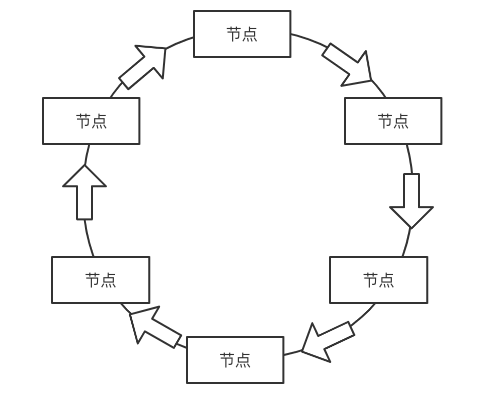
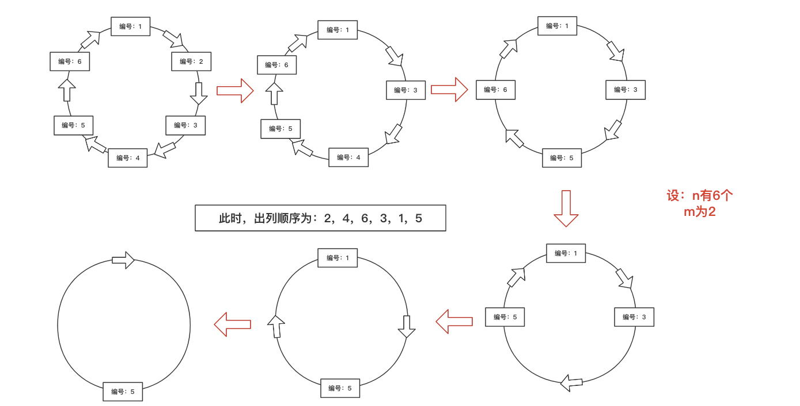

### 单向环形链表

#### 介绍




#### Josepfu（约瑟夫、约瑟夫环）问题

设：

- 编号为1，2，3... n的n个人围成一个圈

- 约定编号为k（1 <= k <= n）的人从1开始报数，数到m编号的那个人出列，它的下一个人又从1开始报数，数到m的那个人又出列，以此类推，直到所有人都出列为止
- 此时，就会产生一个出列编号的序列

此时，约瑟夫问题就可以使用环形链表来解决




#### 代码实现

创建节点

```java
public class Node {
    private int no;
    private Node next;

    public Node() {
    }

    public Node(int no) {
        this.no = no;
    }

    public int getNo() {
        return no;
    }

    public void setNo(int no) {
        this.no = no;
    }

    public Node getNext() {
        return next;
    }

    public void setNext(Node next) {
        this.next = next;
    }

    @Override
    public String toString() {
        return "Node{" +
                "no=" + no +
                ", next=" + next +
                '}';
    }
}
```

创建环形链表

```java
public class CircularLinkedList {

    // 创建一个first节点，默认没有编号
    private Node first = null;
}
```


##### 添加功能

```java
    public void addNode(int num){
        if (num <= 0){
            System.out.println("请输入0以上的数字");
            return;
        }

        // 创建辅助指针
        Node currenNode = null;

        // 循环创建环形链表的节点
        for (int i = 1; i <= num; i++) {
            // 创建节点
            Node node = new Node(i);

            // 判断是否是第一个节点
            if (i == 1){
                // 将第一个节点指向为node
                first = node;
                // 将第一个节点的next域指向为自己
                first.setNext(first);
                // 指向当前节点为first
                currenNode = first;
            }else {
                // 将辅助节点的next域指向为新创建的节点
                currenNode.setNext(node);
                // 将新创建的节点的next域指向为第一个节点，形成环形链表
                node.setNext(first);
                // 辅助节点后移
                currenNode = currenNode.getNext();
            }
        }
    }
```


##### 环形链表遍历

```java
    // 遍历环形链表
    public void show(){
        if (first == null){
            System.out.println("当前环形链表为空");
            return;
        }
        Node currentNode = first;

        while (true){
            System.out.println("当前编号：" + currentNode.getNo());
            if (currentNode.getNext() == first){
                break;
            }
            currentNode = currentNode.getNext();
        }
    }

```


#### 约瑟夫问题解决

```java
    public void countNode(int startNo, int num, int count){
        // 判断参数
        if (first == null || startNo < 1 || startNo > count){
            System.out.println("请输入正确的参数");
            return;
        }

        // 创建helper，用于链表中的参数出列
        Node helper = first;
        // 循环移动helper的位置，移动到第一个节点的前一个节点的位置
        while (helper.getNext() != first){
            helper = helper.getNext();
        }
        System.out.println("helper移动到first后面：" + helper.getNo());

        // 移动first和helper的位置到指定的开始位置，开始位置由于包括自己本身，只需移动（startNo - 1）个位置
        for (int i = 0; i < startNo - 1; i++) {
            first = first.getNext();
            helper = helper.getNext();
        }

        System.out.println("first和helper移动到开始位置，first的位置：" + first.getNo() + "，helper的位置：" + helper.getNo());

        // 循环将节点出列，并记录出列的编号
        while (first != helper){
            //  移动first和helper到指定参数的位置，移动次数由于包括自己本身，只需移动（num - 1）个位置
            for (int i = 0; i < num - 1; i++) {
                first = first.getNext();
                helper = helper.getNext();
            }
            System.out.println("当前出列编号：" + first.getNo());
            // 由于需要将移动后的编号出列，需要将first移动到下一个节点的位置
            first = first.getNext();
            // 接着将原先first的位置出列，即将原先first的前一个节点的next域指向移动后的first即可
            helper.setNext(first);
        }
        System.out.println("最后存在圈中的编号为：" + first.getNo());
    }
```

