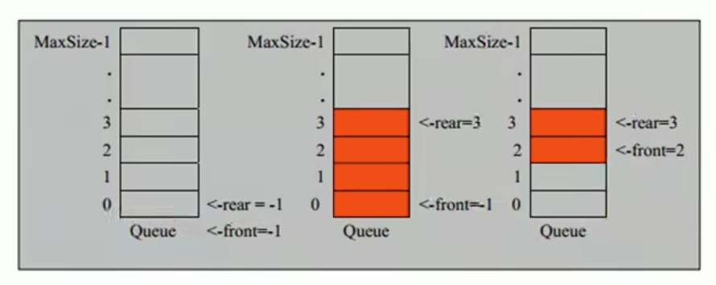
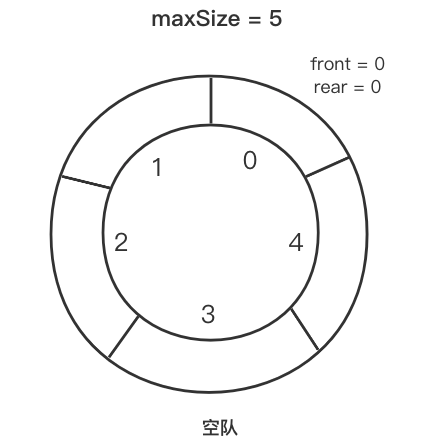
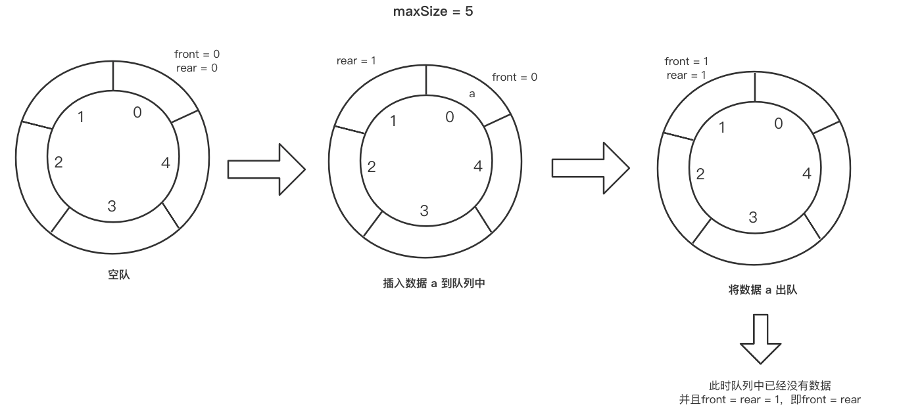
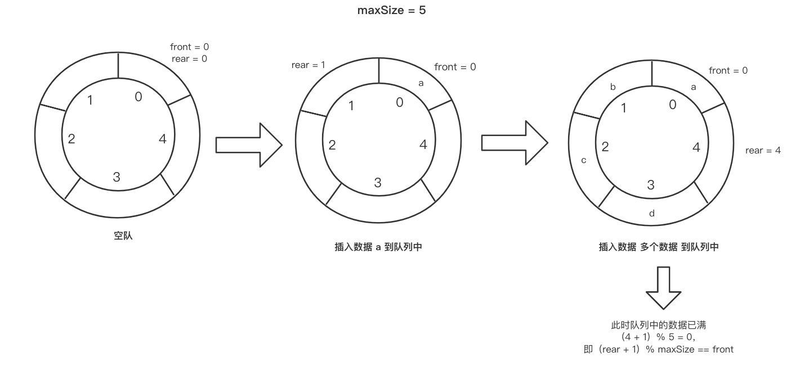
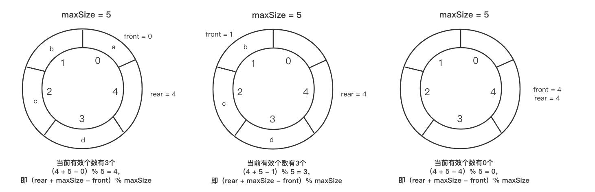

### 队列（Queue）

队列是一个有序的列表，可以使用**数组**或者**链表**来实现

- 使用数组来实现的称为：顺序存储
- 使用链表来实现的称为：链式存储

队列是遵循**先进先出**的原则，即：存入队列的数据，先存储的数据，会先取出来，后存储的数据，则后取出来


#### 一、数组模拟队列



- maxSize：该队列中最大的容量

- front：队列头，随着数据的输出而改变
- rear：队列尾：随着数据的输入而改变
- arr：用于存放存储的数据


##### (一) 思路分析

（一）存入队列的思路

将数据往队列中添加时，队列头（rear）要往后移一位，即rear + 1，但是需要满足队列未满的情况

- 当队列已满，rear == maxSize - 1


（二）获取队列的思路

获取队列数据时，队列尾（front）要往后移动一位，即front + 1，但是需要满足队列不为空的情况

- 当队列为空，front == rear


##### (二) 代码实现

```java
public class ArrayQueue {
    private int maxSize; // 表示队列的最大容量
    private int front;   // 队列头
    private int rear;    // 队列尾
    private int[] arr;   // 该数组用于存放数据

    // 测试
    public static void main(String[] args) {
        // 1. 创建一个队列
        ArrayQueue queue = new ArrayQueue(3);

        // 2. 存入数据
        queue.addQueue(10);
        queue.addQueue(20);
        queue.addQueue(30);
        queue.showQueue(); // 显示队列所有数据

        // 3. 取出数据
        System.out.println("取出数据：" + queue.getQueue());
        System.out.println("取出数据：" + queue.getQueue());

        // 4. 获取头数据
        System.out.println("头数据：" + queue.getHeadQueue());
    }

    /**
     * 1. 创建队列构造器，用于初始化队列的参数
     * @param maxSize 队列最大容量
     */
    public ArrayQueue(int maxSize) {
        this.maxSize = maxSize;
        arr = new int[maxSize];
        front = -1; // 指向队列的头部
        rear = -1;  // 指向队列的尾部
    }

    /**
     * 2. 创建判断队列是否已满的方法
     * @return boolean
     */
    public boolean isFull(){
        return rear == maxSize - 1;
    }

    /**
     * 3. 创建判断队列是否为空的方法
     * @return boolean
     */
    public boolean isEmpty(){
        return rear == front;
    }

    /**
     * 4. 添加队列的方法
     * @param n 数据
     */
    public void addQueue(int n){
        // 判断队列是否已满
        if (isFull()) {
            System.out.println("队列已满，不能加入数据");
            return;
        }

        // 尾指针要往后移动一位，并添加数据到队列
        arr[++rear] = n;
    }

    /**
     * 5. 获取队列数据
     * @return int
     */
    public int getQueue(){
        // 判断队列是否为空
        if (isEmpty()) {
            throw new ArrayIndexOutOfBoundsException("队列为空，不能获取数据");
        }

        // 将头指针往后移动一位，并将获取的数据返回
        return arr[++front];
    }

    /**
     * 6. 显示队列所有数据
     */
    public void showQueue(){
        // 判断队列是否为空
        if (isEmpty()) {
            System.out.println("队列为空");
            return;
        }

        // 遍历数组
        System.out.print("遍历队列：");
        for (int item : arr) {
            System.out.print(item + "\t");
        }
        System.out.println();
    }

    /**
     * 7. 获取头数据
     * @return int
     */
    public int getHeadQueue(){
        // // 判断队列是否为空
        if (isEmpty()) {
            throw new ArrayIndexOutOfBoundsException("队列为空，不能获取数据");
        }

        return arr[front++];
    }
}
```


##### (三) 队列问题

当前队列使用一次就不能使用了，没有进行复用

问题解决：使用算法，将队列改进成环形队列（取模的方式）


#### 二、数组模拟环形队列

将数组的队列头（front）和队列尾连接起来，形成一个环形的顺序表，即把存储队列元素的表从逻辑上看成一个环，称为环形队列或者循环队列



##### (一) 思路分析

需要将front 和 rear的含义做一个调整，并且有一个空间作为约定不使用

- front：用于指向队列第一个元素，并且初始化为0
- rear：用于指向队列中最后一个元素的后一个位置，并且初始化也为0


**（一）当队列为空时，应该满足front == rear**



**（二）当队列已满时，应该满足（rear + 1）% maxSize == front**



**（三）队列中有效的个数，应该满足（rear + maxSize - front）% maxSize**



（四）队列头（front）每次移动，应该在**队列不为空**的情况下满足移动，即**（front + 1）% maxSize**防止数组的下标越界

（五）队列尾（rear）每次移动，应该在**队列未满**的情况下满足移动，即**（rear + 1）% maxSize**防止数组的下标越界

##### (二) 代码实现

```java
public class CircleArrayQueue {
    private int maxSize; // 表示队列的最大容量
    private int front;   // 队列头，指队列有效个数的第一个元素
    private int rear;    // 队列尾，指队列最后一个元素的后一个位置
    private int[] arr;   // 该数组用于存放数据

  	// 测试
    public static void main(String[] args) {
        CircleArrayQueue queue = new CircleArrayQueue(5);

        // 1. 存入数据
        queue.addQueue(10);
        queue.addQueue(20);
        queue.addQueue(30);
        queue.addQueue(40);
        queue.addQueue(50);

        // 2. 获取头数据
        System.out.println("头数据：" + queue.getHeadQueue());

        // 3. 取出数据
        System.out.println(queue.getQueue());
        System.out.println(queue.getQueue());
        System.out.println(queue.getQueue());
        System.out.println(queue.getQueue());
        System.out.println(queue.getQueue());
    }

    /**
     * 1. 创建队列构造器，用于初始化队列的参数
     * @param maxSize 队列最大容量
     */
    public CircleArrayQueue(int maxSize) {
        this.maxSize = maxSize;
        arr = new int[maxSize];
    }

    /**
     * 2. 创建判断队列是否已满的方法
     * @return boolean
     */
    public boolean isFull(){
        return (rear + 1) % maxSize == front;
    }

    /**
     * 3. 创建判断队列是否为空的方法
     * @return boolean
     */
    public boolean isEmpty(){
        return rear == front;
    }

    /**
     * 4. 添加队列的方法
     * @param n 数据
     */
    public void addQueue(int n){
        // 判断队列是否已满
        if (isFull()) {
            System.out.println("队列已满，不能加入数据");
            return;
        }

      	// 输出每次添加队列 队列尾的下标
        System.out.println("addQueue rear = " + rear);

        // 直接将数据加入
        arr[rear] = n;
        // 尾指针后移，并且需要考虑取模，防止下标越界
        rear = (rear + 1) % maxSize;
    }

    /**
     * 5. 获取队列数据
     * @return int
     */
    public int getQueue(){
        // 判断队列是否为空
        if (isEmpty()) {
            throw new ArrayIndexOutOfBoundsException("队列为空，不能获取数据");
        }

      	// 输出每次添加队列 队列头的下标
        System.out.println("getQueue front = " + front);

        // front指向队列的第一个元素
        // 1. 将front对应的值保存到临时的变量
        int value = arr[front];
        // 2. 将头指针后移，并且需要考虑取模，防止下标越界
        front = (front + 1) % maxSize;
        return value;
    }

    /**
     * 6. 获取队列的有效个数
     * @return int
     */
    public int getSize(){
        return (rear + maxSize - front) % maxSize;
    }

    /**
     * 7. 显示队列所有数据
     */
    public void showQueue(){
        // 判断队列是否为空
        if (isEmpty()) {
            System.out.println("队列为空");
            return;
        }

        // 遍历队列
        System.out.print("遍历数据：");
        for (int i = front; i < front + getSize(); i++) {
            System.out.print("下标：" + (i % maxSize) + "，值为：" + arr[i % maxSize]);
        }
    }

    /**
     * 8. 获取头数据
     * @return int
     */
    public int getHeadQueue(){
        // // 判断队列是否为空
        if (isEmpty()) {
            throw new ArrayIndexOutOfBoundsException("队列为空，不能获取数据");
        }
        return arr[front];
    }
}
```