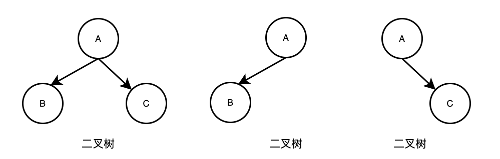
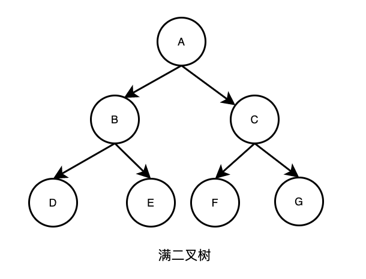
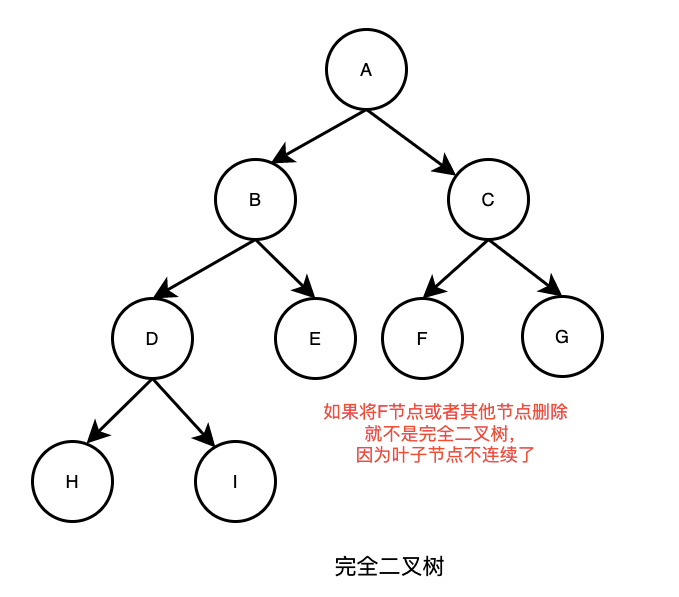

### 二叉树

树有很多种，但是**每个节点只能最多有两个子节点**的树称为二叉树

二叉树的子节点分为**左节点**和**右节点**

当二叉树的所有叶子节点都在最后一层时，那么节点的总数为**2ⁿ - 1**，n为层数，这时可以称这个二叉树为**满二叉树**

当二叉树的所有叶子节点都在最后一层或者倒数第二层，并且最后一层的叶子节点在左边连续，倒数第二层的叶子节点在右边连续时，称这个二叉树为完全二叉树 

#### 二叉树前序遍历

前序遍历：先输出父节点，在遍历左节点，最后遍历右节点

##### (一) 思路分析

- 创建一个二叉树
- 先输出当前节点（初始为根节点root）
- 接着判断左节点是否为空，如果左节点不为空，那么继续进行前序遍历
- 接着判断右节点是否为空，如果右节点不为空，那么继续进行前序遍历

#### 二叉树中序遍历

中序遍历：先输出左节点，在遍历父节点，最后遍历右节点

##### (一) 思路分析

- 创建一个二叉树
- 首先判断左节点是否为空，如果左节点不为空，那么继续进行中序遍历
- 接着输出当前节点，即父节点
- 接着判断右节点是否为空，如果右节点不为空，那么继续进行中序遍历

#### 二叉树后序遍历

后序遍历：先输出左节点，在遍历右节点，最后遍历父节点

##### (一) 思路分析

- 创建一个二叉树
- 首先判断左节点是否为空，如果左节点不为空，那么继续进行后序遍历
- 接着判断右节点是否为空，如果右节点不为空，那么继续进行后序遍历
- 接着输出当前节点，即父节点

