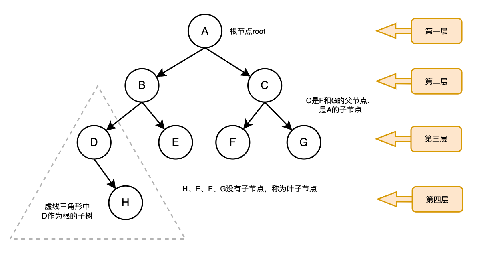

## 树的常用术语

树是由一些节点组成的集合，这个集合可以是空集

如果该集合不是空集，那么这个树是有根节点和0或多个非空子树组成

> 节点：如上图，每一个圆就代表一个节点
>
> 根节点（root）：也称为树根，所有非空树中，有且仅有一个根节点，根节点没有父节点，如上图
>
> 父节点：一个节点有子节点，那么这个节点就是父节点，如上图，A就是C的父节点
>
> 子节点：一个节点含有的子树的根节点称为该节点的子节点，如上图，F和G就是C的子节点
>
> 叶子节点：没有子节点的节点，称为叶子节点，如上图，H、E、F、G就是叶子节点
>
> 节点的权：就是节点的值，如上图，A的权值就是A
>
> 路径：从根节点root找到该节点的路径，如上图，D的路径就是A --> B --> D
>
> 层：从根开始定义起，根为第1层，根的子节点为第2层，以此类推；
>
> 子树：树的其中一个节点以及其下面的所有的节点所构成的树，如上图，虚线中D作为根就可以构成一颗子树
>
> 树的高度（深度）：树的最大层数，如上图，树的高度就为4
>
> 森林：多棵子树所构成了森林