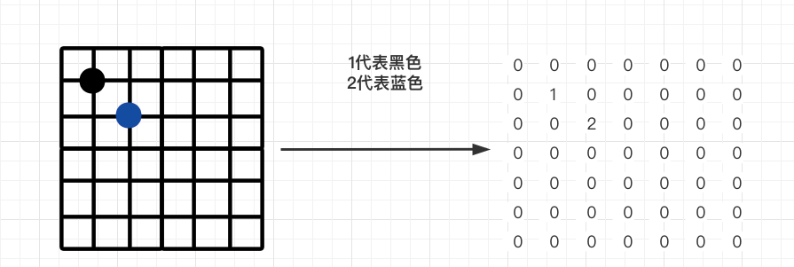
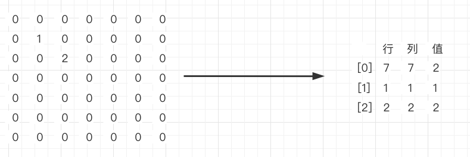

### 稀疏数组（Sparse Array）

问题：在编写五子棋的程序中，有存盘退出和续上盘的功能



当直接使用二维数组记录五子棋的棋子时，如上图，会发现没有下棋的位置都是默认值为0

因此出现了很多没有意义的数据

而稀疏数组就是用于解决这种多余的数据


#### 基本介绍

当一个数组中大部分数据元素都为0，或同一个值的数组时，可以使用稀疏数组来保存该数组


稀疏数组处理方式：

- 记录数组一共有几行几列，有多少个不同的值
- 把具有不同的值的元素的行列和值记录到一个小规模的数组中没，从而缩小程序的规模



二维数组转换为稀疏数组，如上图，但是稀疏数组的第一条记录记录的是原来二维数组的多少行、多少列和多少个值，第二条记录开始后面的都是记录原来非0数据的行、列和值


#### 思路分析

（一）二维数组转换为稀疏数组的思路

- 遍历原始二维数组，得到有效数据【即非0的数据】的个数sum
- 根据有效数据个数sum创建稀疏数组sparseArray，行为 sum + 1行，列为 3行
- 将二维数组的有效数据存入到稀疏数组中


（二）稀疏数组转换为二维数组的思路

- 先读取稀疏数组的第一行，根据第一行的数据，创建原始的二维数组
- 在读取稀疏数组的后几行的数据，并赋给原始的二维数组即可


#### 代码实现

```java
/**
 * 稀疏数组实现
 */
public class SparseArray {

    // 创建原始的二维数组 11 * 11
    // 0：表示没有棋子
    // 1：表示黑色的棋子
    // 2：表示蓝子的棋子
    private int[][] chessArray = new int[11][11];

    @Test
    public void test(){
        initChessArray();

        System.out.println("======== 遍历原始数组 ========");
        ergodicArray(chessArray);

        int[][] sparseArray = transformationSparseArray();

        System.out.println("======== 遍历稀疏数组 ========");
        ergodicArray(sparseArray);

        int[][] newChessArray = transformationChessArray(sparseArray);

        System.out.println("======== 遍历恢复的原始数组 ========");
        ergodicArray(newChessArray);
    }

    /**
     * 初始化原始二维数组
     */
    private void initChessArray(){
        chessArray[1][2] = 1;
        chessArray[2][3] = 2;
    }

    /**
     * 转换稀疏数组
     * @return 稀疏数组
     */
    private int[][] transformationSparseArray(){
        // 将二维数组转换为稀疏数组
        // 1. 遍历原始二维数组，得到有效数据【即非0的数据】的个数
        int sum = 0;
        for (int i = 0; i < chessArray.length; i++) {
            for (int j = 0; j < chessArray[i].length; j++) {
                if (chessArray[i][j] != 0){
                    sum++;
                }
            }
        }
        System.out.println("有效数据个数：" + sum);

        // 2. 根据有效数据个数sum创建稀疏数组，行为 sum + 1行，列为 3行
        int[][] sparseArray = new int[sum + 1][3];

        // 3. 将二维数组的有效数据存入到稀疏数组中
        // 3.1 将原始数组的行、列和有效数据个数存入到第一行
        sparseArray[0][0] = chessArray.length;
        sparseArray[0][1] = chessArray[0].length;
        sparseArray[0][2] = sum;

        // 3.2 遍历二维数组，将有效数据存入到稀疏数组
        int count = 0; // 用于记录第几个有效数据
        for (int i = 0; i < chessArray.length; i++) {
            for (int j = 0; j < chessArray[i].length; j++) {
                if (chessArray[i][j] != 0){
                    count++;
                    sparseArray[count][0] = i;
                    sparseArray[count][1] = j;
                    sparseArray[count][2] = chessArray[i][j];
                }
            }
        }

        return sparseArray;
    }

    /**
     * 转换原始数组
     * @param sparseArray 稀疏数组
     * @return 转换后的原始数组
     */
    private int[][] transformationChessArray(int[][] sparseArray){
        // 将稀疏数组转换成原始数组
        // 1. 先读取稀疏数组的第一行，根据第一行的数据，创建原始的二维数组
        int[][] newArray = new int[sparseArray[0][0]][sparseArray[0][1]];

        // 2. 在读取稀疏数组的后几行的数据，并赋给原始的二维数组即可
        for (int i = 1; i < sparseArray.length; i++) {
            newArray[sparseArray[i][0]][sparseArray[i][1]] = sparseArray[i][2];
        }

        return newArray;
    }

    /**
     * 遍历二维数组
     * @param array 遍历的数组
     */
    private void ergodicArray(int[][] array){
        for (int[] row : array) {
            for (int item : row) {
                System.out.print(item + "\t");
            }
            System.out.println();
        }
    }
}
```


运行结果：

```
======== 遍历原始数组 ========
0	0	0	0	0	0	0	0	0	0	0	
0	0	1	0	0	0	0	0	0	0	0	
0	0	0	2	0	0	0	0	0	0	0	
0	0	0	0	0	0	0	0	0	0	0	
0	0	0	0	0	0	0	0	0	0	0	
0	0	0	0	0	0	0	0	0	0	0	
0	0	0	0	0	0	0	0	0	0	0	
0	0	0	0	0	0	0	0	0	0	0	
0	0	0	0	0	0	0	0	0	0	0	
0	0	0	0	0	0	0	0	0	0	0	
0	0	0	0	0	0	0	0	0	0	0	
有效数据个数：2
======== 遍历稀疏数组 ========
11	11	2	
1		2		1	
2		3		2	
======== 遍历恢复的原始数组 ========
0	0	0	0	0	0	0	0	0	0	0	
0	0	1	0	0	0	0	0	0	0	0	
0	0	0	2	0	0	0	0	0	0	0	
0	0	0	0	0	0	0	0	0	0	0	
0	0	0	0	0	0	0	0	0	0	0	
0	0	0	0	0	0	0	0	0	0	0	
0	0	0	0	0	0	0	0	0	0	0	
0	0	0	0	0	0	0	0	0	0	0	
0	0	0	0	0	0	0	0	0	0	0	
0	0	0	0	0	0	0	0	0	0	0	
0	0	0	0	0	0	0	0	0	0	0	
```

