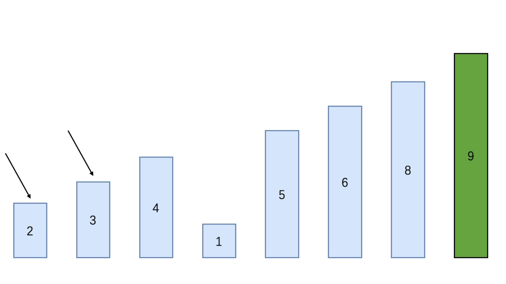
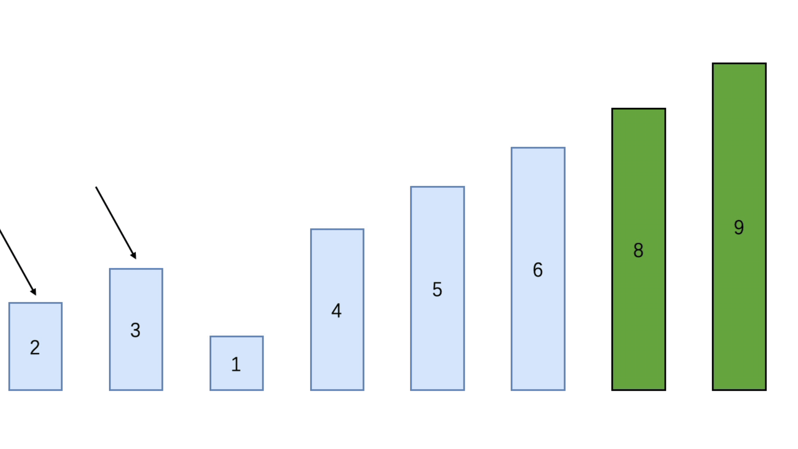
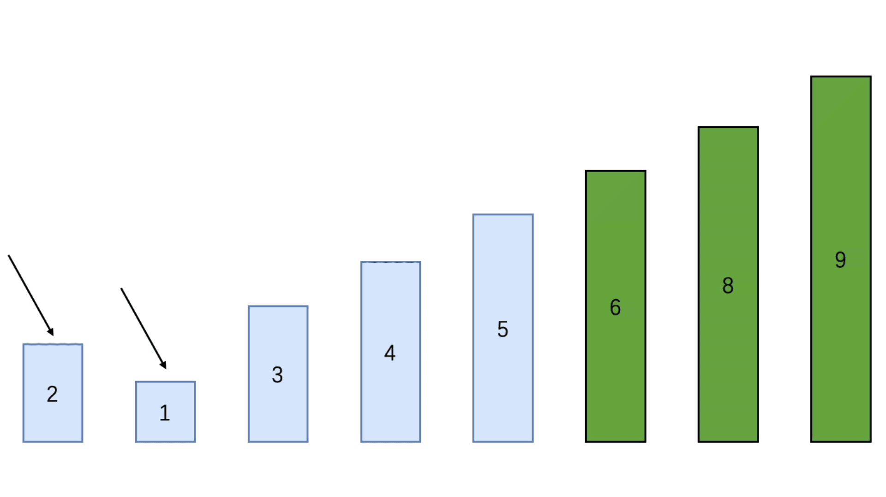

### 冒泡排序（Bubble Sort）

冒泡排序属于内部排序

冒泡排序基本思想：通过排序序列从前往后（即从下标0开始），依次比较相邻的元素，若发现逆序（即前一个元素比后一个元素大）则进行交换，使值较大（或较小）的值逐渐从前移到后面去

时间复杂度：O(n²)


#### 冒泡排序思路分析

例如：使用冒泡将2、6、3、4、1、5、9、8进行排序

##### 第一次排序

使用两个指针，第一个指针指向第一个元素，第二个指针指向第二个元素

- 循环遍历，依次比较两个指针中的元素大小

- 当第一个指针的元素比第二个指针的元素大时，两个指针位置的元素进行交换
- 两个指针的位置后移，以此类推
- 直到第二个指针指向最后一个元素并进行两个指针元素大小的比较后，完成第一次排序

当第一次循环结束后，会将最大的元素摆放在最后一个位置上，之后的循环比较将不会比较最后一个元素

这里最后比较得出最大的元素为9，得出的排序顺序为：2、3、4、1、5、6、8、9


##### 第二次排序

使用两个指针，第一个指针指向第一个元素，第二个指针指向第二个元素

- 循环遍历，依次比较两个指针中的元素大小
- 当第一个指针的元素比第二个指针的元素大时，两个指针位置的元素进行交换
- 两个指针的位置后移，以此类推
- 直到第二个指针指向倒数第二个元素并进行两个指针元素大小的比较后，完成第二次排序

当第二次循环结束后，除最大元素外的第二大的元素会摆放到倒数第二个位置，之后的循环比较将不会比较这个元素

这里最后比较得出最大的元素为9，得出的排序顺序为：2、3、1、4、5、6、8、9



##### 第三次排序



##### 第四次排序



到第四次排序，基本上顺序已经是排序好了，接下来的排序依然如此，判断前后元素的大小，交换位置即可

但是，如果继续进行判断会有些浪费了，因为当前的排序是已经排序好了，所以可以在此基础上进行优化，只需在进行一排排序，判断是否有元素交换位置，如果有元素交换位置说明当前的顺序是没有排序好的，如果没有则说明当前顺序已经排序好了，结束排序即可


#### 代码实现

##### 未优化的冒泡排序

```java
public class BubbleNotOptimized {
    public static void main(String[] args) {
        int[] arr = {2, 6, 3, 4, 1, 5, 9, 8};

        System.out.println("排序前的数组：" + Arrays.toString(arr));

        int temp = 0;

        // 第一层循环：用于控制排序需要排多少次
        for (int i = 0; i < arr.length - 1; i++) {
            // 第二层循环：用于控制每次排序，元素间的比较次数
            for (int j = 0; j < arr.length - 1 - i; j++) {
                if (arr[j] > arr[j + 1]){
                    // 元素位置交换
                    temp = arr[j];
                    arr[j] = arr[j + 1];
                    arr[j + 1] = temp;
                }
            }
        }

        System.out.println("排序后的数组：" + Arrays.toString(arr));
    }
}
```


##### 优化后的冒泡排序

```java
public class BubbleOptimized {
    public static void main(String[] args) {
        int[] arr = {2, 6, 3, 4, 1, 5, 9, 8};

        System.out.println("排序前的数组：" + Arrays.toString(arr));

        int temp = 0;
        boolean flag = false;
        // 第一层循环：用于控制排序需要排多少次
        for (int i = 0; i < arr.length - 1; i++) {
            // 第二层循环：用于控制每次排序，元素间的比较次数
            for (int j = 0; j < arr.length - 1 - i; j++) {
                if (arr[j] > arr[j + 1]){
                    flag = true;
                    // 元素位置交换
                    temp = arr[j];
                    arr[j] = arr[j + 1];
                    arr[j + 1] = temp;
                }
            }

            if (!flag) break;
            // 进行下次排序的判断
            flag = false;
        }

        System.out.println("排序后的数组：" + Arrays.toString(arr));
    }
}
```


#### 事后统计方法测试速度

```java
public class TestBubbleSpeed {

    public static void main(String[] args) {
        int[] arr = new int[80000];

        for (int i = 0; i < 80000; i++) {
            arr[i] = (int)(Math.random() * 80000);
        }

        SimpleDateFormat format = new SimpleDateFormat("HH:mm:ss");
        String beforeTime = format.format(new Date());
        System.out.println("执行前时间：" + beforeTime); // 20:37:31

        TestBubbleSpeed.bubble(arr);

        String afterTime = format.format(new Date());
        System.out.println("执行后时间：" + afterTime); // 20:37:44
    }

    public static int[] bubble(int[] arr){
        int temp = 0;
        boolean flag = false;
        for (int i = 0; i < arr.length - 1; i++) {
            for (int j = 0; j < arr.length - 1 - i; j++) {
                if (arr[j] > arr[j + 1]){
                    flag = true;
                    temp = arr[j];
                    arr[j] = arr[j + 1];
                    arr[j + 1] = temp;
                }
            }
            if (!flag) break;
            flag = false;
        }
        return arr;
    }
}
```

执行前时间：20:37:31

执行后时间：20:37:44