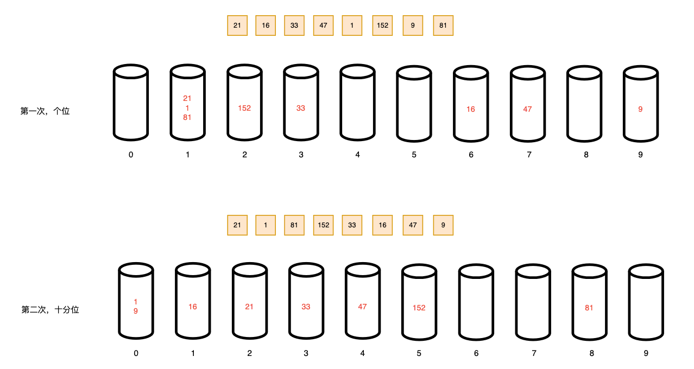
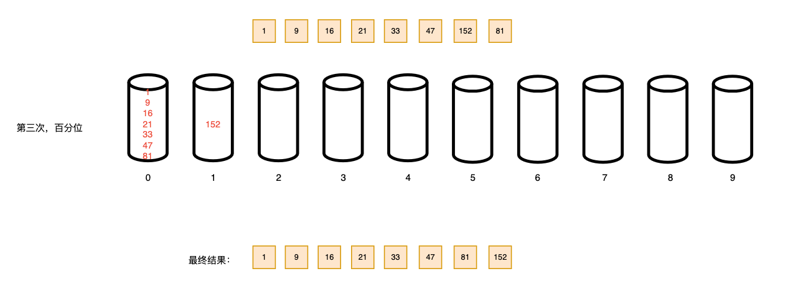

### 基数排序（Radix Sort）

基数排序，属于"分配式排序"（distribution sort），又称"桶排序"（bucket sort或bin sort），于1887年赫尔曼 · 何乐礼发明

通过键值各个位的值，将要排序的元素分配到某些"桶"中，从而达到排序的作用

基数排序属于稳定性的排序，是效率高的稳定性排序

基数排序是桶排序的扩展


#### 基本思想

将所有需要比较的数值统一成同样的数位长度，数位较短的数前面补零，例如：4需要统一成百位，那么将4前面补两个零，变成004

接着依次从最低位开始，依次进行一次排序，当最低位到最高位排序完成后，数列就变成一个有序序列





#### 代码实现（不支持负数）

```java
public class RadixSort {

    public static void main(String[] args) {
        int[] arr = {21, 16, 33, 47, 1, 152, 9, 81};

        radix(arr);
        System.out.println("最终结果：" + Arrays.toString(arr));
    }

    public static void radix(int[] arr){

        // 获取数组中的最大数
        int max = arr[0];
        for (int i = 0; i < arr.length; i++) {
            max = Math.max(max, arr[i]);
        }
        // 获取最大数的位数
        int maxLength = String.valueOf(max).length();

        // 创建桶
        int[][] bucket = new int[10][arr.length];
        // 记录每个桶中所存放的数据个数
        int[] bucketCount = new int[10];

        // 循环最大值的位数
        for (int i = 0, n = 1; i < maxLength; i++, n *= 10) {
            // 将每个元素中的各个位数放入桶中
            for (int j = 0; j < arr.length; j++) {
                int elementDigit = arr[j] / n % 10;
                bucket[elementDigit][bucketCount[elementDigit]++] = arr[j];
            }

            // 将桶中所有的元素按照顺序获取，并放入数组中
            int index = 0;
            for (int j = 0; j < bucketCount.length; j++) {
                if (bucketCount[j] != 0){
                    for (int k = 0; k < bucketCount[j]; k++) {
                        arr[index++] = bucket[j][k];
                    }
                    bucketCount[j] = 0;
                }
            }

            //System.out.println("第" + (i + 1) + "次排序，结果为：" + Arrays.toString(arr));
        }
    }
}
```


#### 代码实现（支持负数）

查找需要排序的数组最小值，如果最小值为负数，则数组中的所有元素减轻最小值，使得数组中不出现负数。

```java
public class RadixSortByNegative {

    public static void main(String[] args) {
        int[] arr = {-99, 53, -3, 542, 748, -48, 14, 214, -23, -56};

        radix(arr);
        System.out.println("最终结果：" + Arrays.toString(arr));
    }

    public static void radix(int[] arr){
        int max = arr[0];
        int min = arr[0];

        // 获取数组中的最大值和最小值
        for (int i = 1; i < arr.length; i++) {
            max = Math.max(max, arr[i]);
            min = Math.min(min, arr[i]);
        }

        // 当最小值为负数时，需要将数组中所有元素都减去最小值
        // 从而将数组所有元素变为正数
        if (min < 0){
            for (int i = 0; i < arr.length; i++) {
                arr[i] -= min;
            }
            max -= min;
        }

        // 获取最大值的位数
        int maxLength = String.valueOf(max).length();

        // 创建桶
        int[][] bucket = new int[10][arr.length];
        // 记录各个桶中的个数
        int[] bucketCount = new int[10];

        // 循环最大值的位数
        for (int i = 0, n = 1; i < maxLength; i++, n *= 10) {
            // 将每个元素中的各个位数放入桶中
            for (int j = 0; j < arr.length; j++) {
                int elementDigit = arr[j] / n % 10;
                bucket[elementDigit][bucketCount[elementDigit]++] = arr[j];
            }

            // 将桶中所有的元素按照顺序获取，并放入数组中
            int index = 0;
            for (int j = 0; j < bucketCount.length; j++) {
                if (bucketCount[j] != 0){
                    for (int k = 0; k < bucketCount[j]; k++) {
                        arr[index++] = bucket[j][k];
                    }
                    bucketCount[j] = 0;
                }
            }
        }

        // 当数组从小到大排序完毕后，最小值为负数时，需要加上最小值
        // 从而变为原先的数组
        if (min < 0){
            for (int i = 0; i < arr.length; i++) {
                arr[i] += min;
            }
        }
    }
}
```


#### 事后统计方法测试速度

```java
public class TestRadixSortSpeed {
    public static void main(String[] args) {
        int[] arr = new int[80000];

        for (int i = 0; i < 80000; i++) {
            arr[i] = (int)(Math.random() * 80000);
        }

        SimpleDateFormat format = new SimpleDateFormat("HH:mm:ss");
        String beforeTime = format.format(new Date());
        System.out.println("执行前时间：" + beforeTime); // 22:50:43

        RadixSort.radix(arr);

        String afterTime = format.format(new Date());
        System.out.println("执行后时间：" + afterTime); // 22:50:43
    }
}
```

