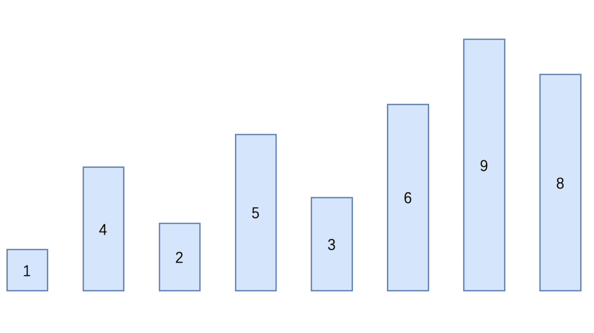

### 希尔排序（Shell Sort）

希尔排序是希尔（Donald Shell）于1959年提出的一种排序算法

希尔排序也是一种插入排序，它是由简单插入排序经过改进后的一种更加高效的版本，也称为**缩小增量排序**

基本思想：

- 将记录的下标的一定增量进行分组
- 对每组使用直接插入排序算法
- 随着增量逐渐缩小，每组包含的关键词越来越多
- 当增量缩减到1时，整个文件被分成一组，希尔排序就完成了


#### 分析

##### 第一次


##### 第二次


##### 第三次



#### 代码实现

##### 交换法

```java
public class ShellSort {
    public static void main(String[] args) {
        int[] arr = {2, 6, 3, 4, 1, 5, 9, 8};

        int count = 0;

        int temp = 0;
        // 第一层循环：用于获取每次排序的增值
        for (int gap = arr.length / 2; gap > 0; gap /= 2) {
            // 第二层循环：用于遍历每组中的元素
            for (int i = gap; i < arr.length; i++) {
                // 获取前gap个元素的位置
                int index = i - gap;

                // 第三层循环：用于对每组元素进行排序
                for (int j = index; j >= 0; j -= gap) {
                    if (arr[j] > arr[j + gap]){
                        temp = arr[j];
                        arr[j] = arr[j + gap];
                        arr[j + gap] = temp;
                    }
                }
            }
            System.out.println("第" + (++count) + "轮排序，结果为：" + Arrays.toString(arr));
        }

        System.out.println("排序完，最终结果：" + Arrays.toString(arr));
    }
}
```

##### 插入法

```java
public class ShellSort {
    public static void main(String[] args) {
        int[] arr = {2, 6, 3, 4, 1, 5, 9, 8};

        int count = 0;
        // 第一层循环：获取每轮循环的增值
        for (int gap = arr.length / 2; gap > 0; gap /= 2) {
            // 第二层循环：循环每层的元素
            for (int i = gap; i < arr.length; i++) {
                // 获取需要插入的元素
                int insertVal = arr[i];
                // 获取需要插入元素的前一个元素的下标位置
                int index = i - gap;

                // 循环和前面的元素进行比较，当前一个元素比需要插入的元素大，那么将前一个元素的位置移到后移 gap个位置
                while (index >= 0 && insertVal < arr[index]){
                    // 后移前一个元素的位置
                    arr[index + gap] = arr[index];
                    index -= gap;
                }
                // 将需要插入的元素放置到适当的位置
                arr[index + gap] = insertVal;
            }
            System.out.println("第" + (++count) + "轮排序，结果为：" + Arrays.toString(arr));
        }
        System.out.println("排序完，最终结果：" + Arrays.toString(arr));
    }
}
```


#### 事后统计方法测试速度

##### 交换法

```java
public class TestShellSpeed {

    public static void main(String[] args) {
        int[] arr = new int[80000];

        for (int i = 0; i < 80000; i++) {
            arr[i] = (int)(Math.random() * 80000);
        }

        SimpleDateFormat format = new SimpleDateFormat("HH:mm:ss");
        String beforeTime = format.format(new Date());
        System.out.println("执行前时间：" + beforeTime); // 21:13:12

        TestShellSpeed.shell(arr);

        String afterTime = format.format(new Date());
        System.out.println("执行后时间：" + afterTime); // 21:13:23
    }

    public static int[] shell(int[] arr){
        int temp = 0;
        for (int gap = arr.length / 2; gap > 0; gap /= 2) {
            for (int i = gap; i < arr.length; i++) {
                int index = i - gap;
                for (int j = index; j >= 0; j -= gap) {
                    if (arr[j] > arr[j + gap]){
                        temp = arr[j];
                        arr[j] = arr[j + gap];
                        arr[j + gap] = temp;
                    }
                }
            }
        }
        return arr;
    }
}
```

##### 插入法

```java
public class TestShellSpeed {
    public static void main(String[] args) {
        int[] arr = new int[80000];

        for (int i = 0; i < 80000; i++) {
            arr[i] = (int)(Math.random() * 80000);
        }

        SimpleDateFormat format = new SimpleDateFormat("HH:mm:ss");
        String beforeTime = format.format(new Date());
        System.out.println("执行前时间：" + beforeTime); // 20:03:50

        TestShellSpeed.shell(arr);

        String afterTime = format.format(new Date());
        System.out.println("执行后时间：" + afterTime); // 20:04:01
    }

    public static int[] shell(int[] arr){
        for (int gap = arr.length / 2; gap > 0; gap /= 2) {
            for (int i = gap; i < arr.length; i++) {
                int insertVal = arr[i];
                int index = i - gap;

                while (index >= 0 && insertVal < arr[index]){
                    arr[index + gap] = arr[index];
                    index -= gap;
                }

                arr[index + gap] = insertVal;
            }
        }
        return arr;
    }
}
```

