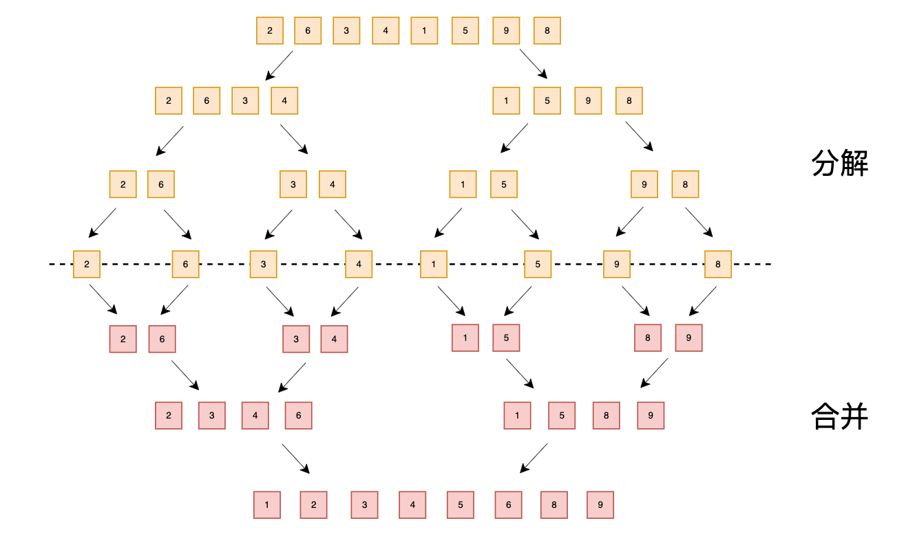
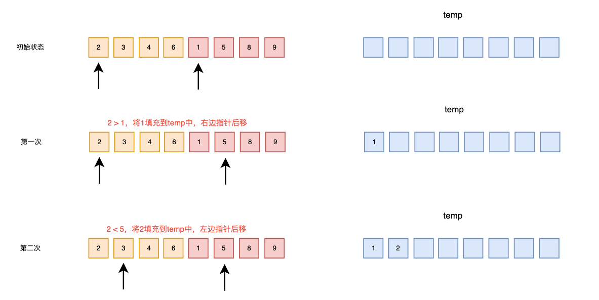
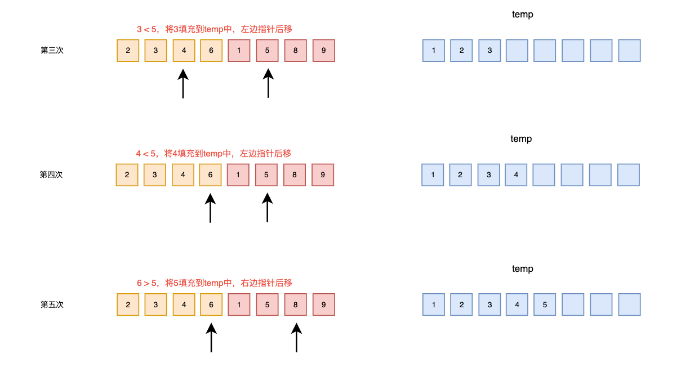
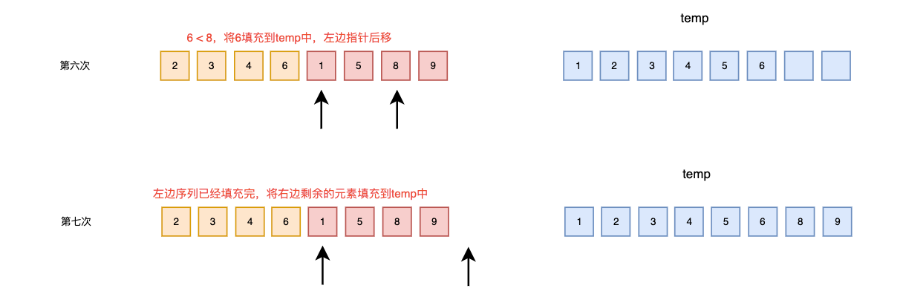

### 归并排序（merge Sort）

归并排序，也称为合并排序，是利用归并的思想实现的排序算法，该算法采用经典的分治法

- 分：将问题分解成一些小的问题，然后使用递归进行解决
- 治：将分阶段的各个答案合并在一起

将已经有序的子序列合并，得到一个完整的有序序列

归并排序时间复杂度：O(nlogn)



#### 思路分析

##### 合并两个有序子序列

需要创建一个临时数组temp，用于存储两个有序序列合并后并且有序的元素

分别对两个有序序列的头元素进行比较，当第一个有序序列的头元素大时，将第二个有序序列的头元素加入temp数组中，否则将第一个有序序列的头元素加入temp

当两个有序序列其中一个序列已经填充完毕，则将另外一个序列剩余的元素添加到temp中








#### 代码实现

##### (一) 递归方式实现

使用递归将序列不断分隔成子序列，直到不能分割为止，接着将排序好的两个相邻子序列进行合并，最终则为一个完整的有序序列

```java
public class MergeSortByRecursion {

    public static void main(String[] args) {
        int[] arr = {2, 6, 3, 4, 1, 5, 9, 8};

        mergeSort(arr, 0, arr.length - 1);
        System.out.println("最终结果：" + Arrays.toString(arr));
    }

    public static void mergeSort(int[] arr, int start, int end) {
        if (start >= end) {
            return;
        }

        // 获取数组中中间的位置
        int mid = (start + end) / 2;

        // 分解数组元素
        mergeSort(arr, start, mid);
        mergeSort(arr, mid + 1, end);

        // 合并数组元素
        merge(arr, start, mid, end);
    }

    // 合并数组元素
    private static void merge(int[] arr, int start, int mid, int end){
        // 第一个组开始的位置
        int s1 = start;
        // 第二个组开始的位置
        int s2 = mid + 1;
        // 用于存储两个合并后并且有序的元素
        int[] ret = new int[end - start + 1];
        int i = 0;

        // 循环对两个组的头元素进行计较
        while (s1 <= mid && s2 <= end){
            // 当第一个组的头元素大于第二个组的头元素时，将第二个组的头元素加入到ret数组中
            // 否则将第一个组的头元素加入到ret数组中
            if (arr[s1] > arr[s2]){
                ret[i++] = arr[s2++];
            }else {
                ret[i++] = arr[s1++];
            }
        }

        // 判断第一个组是否有剩余的元素，有剩余的元素则加入到ret数组中
        while (s1 <= mid){
            ret[i++] = arr[s1++];
        }

        // 判断第二个组是否有剩余的元素，有剩余的元素则加入到ret数组中
        while (s2 <= end){
            ret[i++] = arr[s2++];
        }

        // 将已经合并后并且有序的数组覆盖原先数组位置元素
        for (int j = 0; j < ret.length; j++) {
            arr[start + j] = ret[j];
        }
    }
}
```


##### (二) 非递归方式实现

首先将n个元素分为n个组，然后将相邻的两个组不断进行合并，最终合并成一个组的时候，则为一个完整的有序序列

```java
public class MergeSort {

    public static void main(String[] args) {
        int[] arr = {2, 6, 3, 4, 1, 5, 9, 8};
        //int[] arr = {3, 7, 6, 4, 8, 9, 2};

        mergeSort(arr);
        System.out.println("最终结果：" + Arrays.toString(arr));
    }

    public static void mergeSort(int[] arr){
        // 第一层循环：用于控制每组元素个数
        for (int i = 1; i < arr.length; i *= 2) {
            // start：开始位置
            // mid：中间位置
            // end：结束位置
            int start, mid, end;

            // 对每两组的元素进行合并操作
            int index = 0;
            while (index + i * 2 <= arr.length){
                start = index;
                mid = index + i - 1;
                end = index + i * 2 - 1;
                // 合并操作
                merge(arr, start, mid, end);
                // 移动到下一轮合并的组
                index += i * 2;
            }

            // index + i < arr.length，说明有剩余的组不满组2的n次方幂
            if (index + i < arr.length){
                start = index;
                mid = index + i - 1;
                end = arr.length - 1;
                merge(arr, start, mid, end);
            }
        }
    }

    /**
     * 对指定的两个有序的组进行排序
     * @param arr 数组
     * @param start 开始位置
     * @param mid 中间位置
     * @param end 结束位置
     */
    private static void merge(int[] arr, int start, int mid, int end){
        // 第一个组开始的位置
        int s1 = start;
        // 第二个组开始的位置
        int s2 = mid + 1;
        // 用于存储两个合并后并且有序的元素
        int[] ret = new int[end - start + 1];
        int i = 0;

        // 循环对两个组的头元素进行计较
        while (s1 <= mid && s2 <= end){
            // 当第一个组的头元素大于第二个组的头元素时，将第二个组的头元素加入到ret数组中
            // 否则将第一个组的头元素加入到ret数组中
            if (arr[s1] > arr[s2]){
                ret[i++] = arr[s2++];
            }else {
                ret[i++] = arr[s1++];
            }
        }

        // 判断第一个组是否有剩余的元素，有剩余的元素则加入到ret数组中
        while (s1 <= mid){
            ret[i++] = arr[s1++];
        }

        // 判断第二个组是否有剩余的元素，有剩余的元素则加入到ret数组中
        while (s2 <= end){
            ret[i++] = arr[s2++];
        }

        // 将已经合并后并且有序的数组覆盖原先数组位置元素
        for (int j = 0; j < ret.length; j++) {
            arr[start + j] = ret[j];
        }
    }
}
```


#### 事后统计方法测试速度

##### 递归方式

```java
public class TestMergeSortByRecursion {

    public static void main(String[] args) {
        int[] arr = new int[80000];

        for (int i = 0; i < 80000; i++) {
            arr[i] = (int)(Math.random() * 80000);
        }

        SimpleDateFormat format = new SimpleDateFormat("HH:mm:ss");
        String beforeTime = format.format(new Date());
        System.out.println("执行前时间：" + beforeTime); // 20:49:00

        MergeSortByRecursion.mergeSort(arr, 0, arr.length - 1);

        String afterTime = format.format(new Date());
        System.out.println("执行后时间：" + afterTime); // 20:49:00
    }
}
```


##### 非递归方式

```java
public class TestMergeSort {

    public static void main(String[] args) {
        int[] arr = new int[80000];

        for (int i = 0; i < 80000; i++) {
            arr[i] = (int)(Math.random() * 80000);
        }

        SimpleDateFormat format = new SimpleDateFormat("HH:mm:ss");
        String beforeTime = format.format(new Date());
        System.out.println("执行前时间：" + beforeTime); // 20:49:54

        MergeSort.mergeSort(arr);

        String afterTime = format.format(new Date());
        System.out.println("执行后时间：" + afterTime); // 20:49:54
    }
}
```

