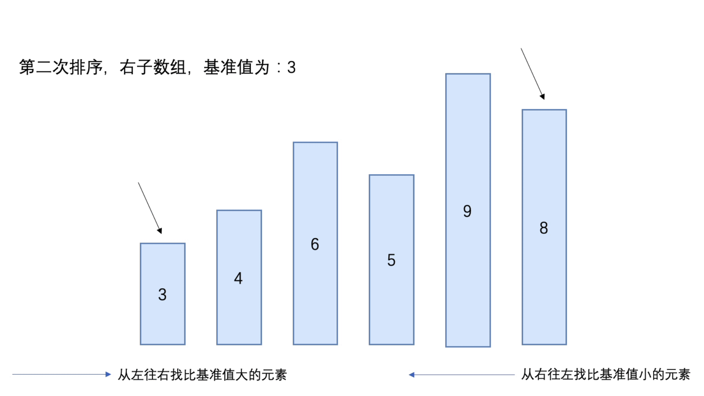
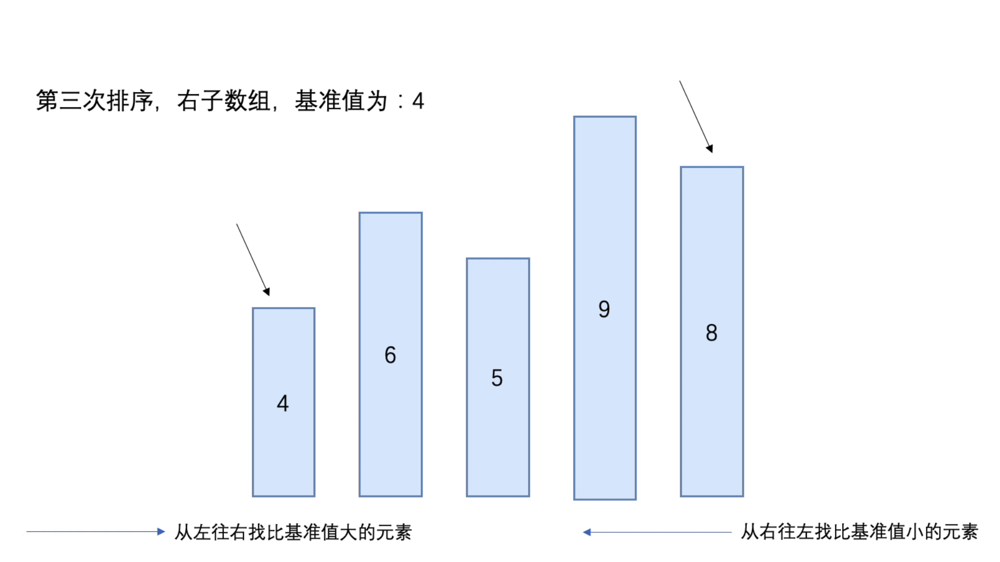
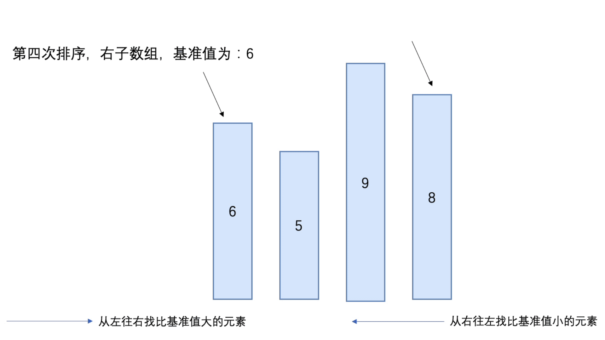
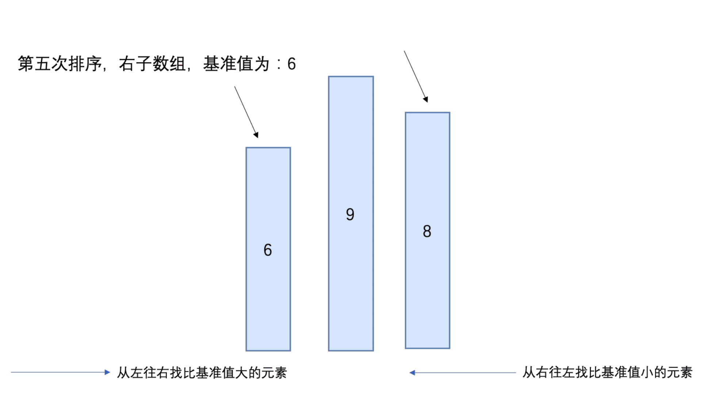
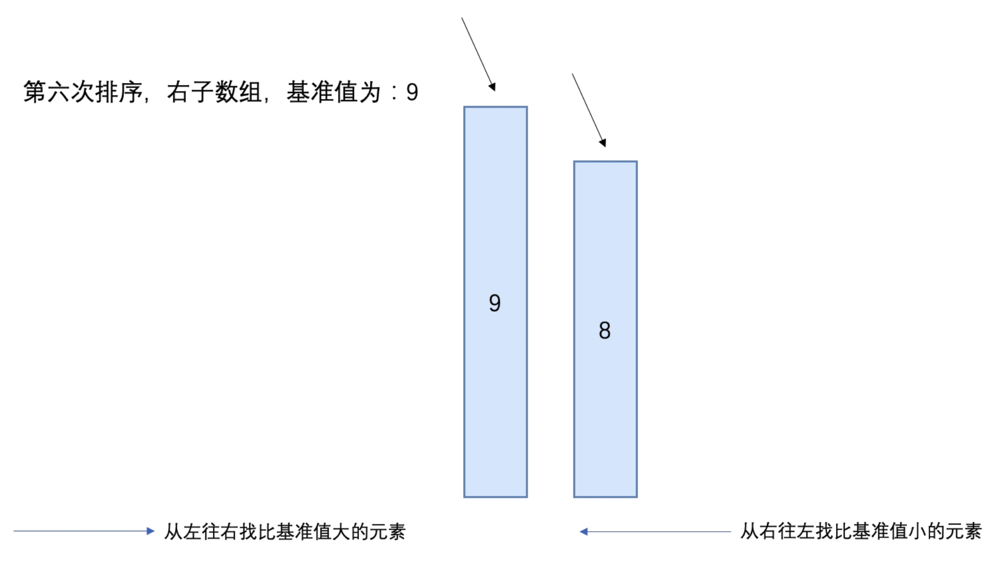

### 快速排序（Quick Sort）

快速排序，是一种对冒泡排序的改进

基本思想：

- 通过一趟排序将要排序的数据分割成独立的两部分，其中一部分的所有数据比另外一部分的所有数据都要小
- 接着再按照此方法对这两部分数据进行快速排序

快速排序时间复杂度：O(n²)


#### 分析

- 从数组中选出一个基准值（一般为数组第一个元素或者数组中间元素）
- 将数组中所有比基准值小的元素放到基准值的前面，形成左子数组，这时左子数组不一定是有序的
- 将数组中所有比基准值小的元素放到基准值的后面，形成右子数组，这时右子数组不一定是有序的
- 当上面的操作完成后，基准值就处于数组的中间位置
- 使用递归将左子数组和右子数组进行以上的操作，最后的结果就为有序的数组

##### 第一次排序


##### 第二次排序



##### 第三次排序



##### 第四次排序



##### 第五次排序



##### 第六次排序




#### 代码实现

```java
public class Quicksort {
    public static void main(String[] args) {
        int[] arr = {2, 6, 3, 4, 1, 5, 9, 8};
        quick(arr, 0, arr.length - 1);
    }

    /**
     * 快速排序实现
     * @param arr 排序的数组
     * @param left 开始位置
     * @param right 结束位置
     */
    public static void quick(int[] arr, int left, int right) {
        if (left < right) {
            int l = left;
            int r = right;

            // 将数组第一个元素作为基准值
            int pivot = arr[l];

            while (l < r) {
                // 从右往左查找比pivot小的值，将r指针前移
                while (l < r && pivot <= arr[r]) {
                    r--;
                }

                // 元素位置交换
                if (l < r) swap(arr, l, r);

                // 从左往右查找比pivot大的值，将l指针后移
                while (l < r && pivot >= arr[l]) {
                    l++;
                }

                // 元素位置交换
                if (l < r) swap(arr, l, r);
            }

            // 当l == r时，将基准值插入
            arr[l] = pivot;

            // 完成左子数组
            quick(arr, left, l - 1);

            // 完成右子数组
            quick(arr, r + 1, right);
        }
    }

    /**
     * 交换数组元素
     * @param arr 数组
     * @param l 第一个元素交换位置
     * @param r 第二个元素交换位置
     */
    private static void swap(int[] arr, int l, int r){
        int temp = arr[l];
        arr[l] = arr[r];
        arr[r] = temp;
    }
}
```


#### 事后统计方法测试速度

```java
public class TestQuickSpeed {
    public static void main(String[] args) {
        int[] arr = new int[80000];

        for (int i = 0; i < 80000; i++) {
            arr[i] = (int)(Math.random() * 80000);
        }

        SimpleDateFormat format = new SimpleDateFormat("HH:mm:ss");
        String beforeTime = format.format(new Date());
        System.out.println("执行前时间：" + beforeTime); // 22:17:53

        Quicksort.quick(arr, 0, arr.length - 1);

        String afterTime = format.format(new Date());
        System.out.println("执行后时间：" + afterTime); // 22:17:53
    }
}
```

执行前时间：22:17:53

执行后时间：22:17:53