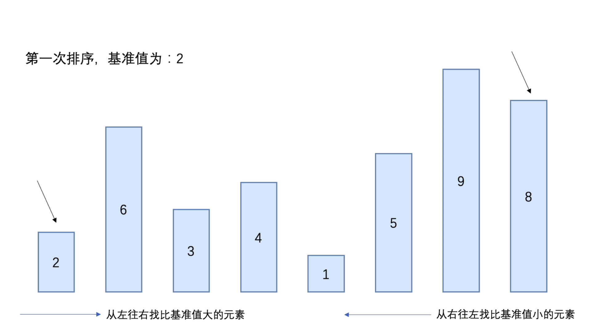

### 快速排序（Quick Sort）

快速排序，是一种对冒泡排序的改进

基本思想：

- 通过一趟排序将要排序的数据分割成独立的两部分，其中一部分的所有数据比另外一部分的所有数据都要小
- 接着再按照此方法对这两部分数据进行快速排序

快速排序时间复杂度：O(n²)


#### 分析

- 从数组中选出一个基准值（一般为数组第一个元素或者数组中间元素）
- 将数组中所有比基准值小的元素放到基准值的前面，形成左子数组，这时左子数组不一定是有序的
- 将数组中所有比基准值小的元素放到基准值的后面，形成右子数组，这时右子数组不一定是有序的
- 当上面的操作完成后，基准值就处于数组的中间位置
- 使用递归将左子数组和右子数组进行以上的操作，最后的结果就为有序的数组

##### 第一次排序



##### 第二次排序


##### 第三次排序


##### 第四次排序


##### 第五次排序


##### 第六次排序


#### 代码实现（递归）

```java
public class Quicksort {
    public static void main(String[] args) {
        int[] arr = {2, 6, 3, 4, 1, 5, 9, 8};

        quick(arr, 0, arr.length - 1);
        System.out.println("最终结果：" + Arrays.toString(arr));
    }

    /**
     * 快速排序实现
     * @param arr 排序的数组
     * @param left 开始位置
     * @param right 结束位置
     */
    public static void quick(int[] arr, int left, int right) {
        if (left < right) {

            // 获取基准值，并且进行左右指针的互换
            int pivot = partition(arr, left, right);

            // 完成左子数组
            quick(arr, left, pivot - 1);

            // 完成右子数组
            quick(arr, pivot + 1, right);
        }
    }

    /**
     * 将比基准值大的元素放到基准值后面
     * 将比基准值小的元素放到基准值前面
     * @param arr 排序的数组
     * @param start 开始位置
     * @param end 结束位置
     * @return int 基准值的下标
     */
    private static int partition(int[] arr, int start, int end){
        // 将数组第一个元素作为基准值
        int pivot = arr[start];

        while (start < end) {
            // 从右往左查找比pivot小的值，将r指针前移
            while (start < end && pivot <= arr[end]) {
                end--;
            }

            // 元素位置交换
            if (start < end) swap(arr, start, end);

            // 从左往右查找比pivot大的值，将l指针后移
            while (start < end && pivot >= arr[start]) {
                start++;
            }

            // 元素位置交换
            if (start < end) swap(arr, start, end);
        }

        // 当l == r时，将基准值插入
        arr[start] = pivot;

        return start;
    }


    /**
     * 交换数组元素
     * @param arr 数组
     * @param start 第一个元素交换位置
     * @param end 第二个元素交换位置
     */
    private static void swap(int[] arr, int start, int end){
        int temp = arr[start];
        arr[start] = arr[end];
        arr[end] = temp;
    }
}
```


#### 代码实现（非递归）

使用栈来实现对元素进行快速排序

```java
public class QuickSortNotRecursion {
    public static void main(String[] args) {
        int[] arr = {2, 6, 3, 4, 1, 5, 9, 8};

        quick(arr, 0, arr.length - 1);

        System.out.println("最终结果：" + Arrays.toString(arr));
    }

    public static void quick(int[] arr, int start, int end){
        if (start >= end){
            return;
        }

        // 创建栈，通过栈来对元素进行快速排序
        Stack<Integer> stack = new Stack<>();
        // 将初始的开始位置和结束位置压入栈中
        stack.push(start);
        stack.push(end);

        while (!stack.isEmpty()){

            // 获取栈顶的第一个元素（结束位置）
            int right = stack.pop();
            // 获取栈顶的第二个元素（开始位置）
            int left = stack.pop();

            // 获取基准值下标
            int pivot = partition(arr, left, right);

            // 将基准值前面元素的开始位置和结束位置压入栈中
            if (left < pivot - 1){
                // 基准值前面元素的开始位置压入栈
                stack.push(left);
                // 基准值前面元素的结束位置压入栈
                stack.push(pivot - 1);
            }

            // 将基准值后面元素的开始位置和结束位置压入栈中
            if (right > pivot + 1){
                // 基准值后面元素的开始位置压入栈
                stack.push(pivot + 1);
                // 基准值后面元素的结束位置压入栈
                stack.push(right);
            }
        }
    }

    /**
     * 将比基准值大的元素放到基准值后面
     * 将比基准值小的元素放到基准值前面
     * @param arr 排序的数组
     * @param start 开始位置
     * @param end 结束位置
     * @return int 基准值的下标
     */
    private static int partition(int[] arr, int start, int end){
        // 假定第一个元素为基准值
        int pivotVal = arr[start];

        // 当开始位置和结束位置不相等时，开始循环
        while (start < end){
            // 从右向左查找比基准值小的元素，并和左边指针（start）指向的元素进行交换
            while (start < end && pivotVal <= arr[end]){
                end--;
            }
            if (start < end) swap(arr, start, end);

            // 从左到右查找比基准值大的元素，并和右边指针（end）指向的元素进行交换
            while (start < end && pivotVal >= arr[start]){
                start++;
            }

            if (start < end) swap(arr, start, end);
        }

        // 将基准值插入start == end的位置
        // 即比基准值小的元素在基准值左边，比基准值大的元素在基准值右边
        arr[start] = pivotVal;

        // 返回基准值下标
        return start;
    }

    /**
     * 交换数组元素
     * @param arr 数组
     * @param start 第一个元素交换位置
     * @param end 第二个元素交换位置
     */
    private static void swap(int[] arr, int start, int end){
        int temp = arr[start];
        arr[start] = arr[end];
        arr[end] = temp;
    }
}
```


#### 事后统计方法测试速度

```java
public class TestQuickSpeed {
    public static void main(String[] args) {
        int[] arr = new int[80000];

        for (int i = 0; i < 80000; i++) {
            arr[i] = (int)(Math.random() * 80000);
        }

        SimpleDateFormat format = new SimpleDateFormat("HH:mm:ss");
        String beforeTime = format.format(new Date());
        System.out.println("执行前时间：" + beforeTime); // 22:17:53

        Quicksort.quick(arr, 0, arr.length - 1);

        String afterTime = format.format(new Date());
        System.out.println("执行后时间：" + afterTime); // 22:17:53
    }
}
```

执行前时间：22:17:53

执行后时间：22:17:53