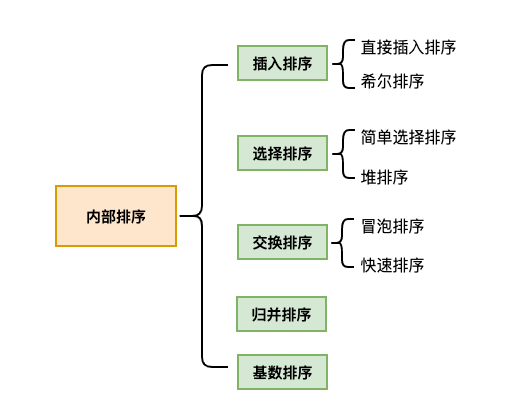

### 排序算法介绍

排序，称为排序算法（Sort Algorithm），是将一组数据，按照指定的顺序进行排列的过程

排序分为两大类：

- 内部排序：指将需要处理的所有数据都加载到内部存储器中进行排序
- 外部排序：当数据量过大，无法全部加载到内存中时，需要借助外部存储进行排序

| 排序  | 平均时间复杂度 | 最坏时间复杂度      | 稳定   | 额外空间 | 备注                                  |
| ----- | -------------- | ------------------- | ------ | -------- | ------------------------------------- |
| 冒泡  | O(n²)          | O(n²)               | 稳定   | O(1)     | n小时较好                             |
| 交换  | O(n²)          | O(n²)               | 不稳定 | O(1)     | n小时较好                             |
| 选择  | O(n²)          | O(n²)               | 不稳定 | O(1)     | n小时较好                             |
| 插入  | O(n²)          | O(n²)               | 稳定   | O(1)     | 大部分已经排序时较好                  |
| 基数  | O(log𝙭N)       | O(log𝙭N)            | 稳定   | O(n)     | N为真数（0-9） x是基数（个十百） |
| shell | O(nlogn)       | O(n^s)【1 < s < 2】 | 不稳定 | O(1)     | s是所选分组                           |
| 快速  | O(nlogn)       | O(n²)               | 不稳定 | O(nlogn) | n大时较好                             |
| 归并  | O(nlogn)       | O(nlogn)            | 稳定   | O(1)     | n大时较好                             |
| 堆    | O(nlogn)       | O(nlogn)            | 不稳定 | O(1)     | n大时较好                             |

AaaaaaaaaaaaaaASAsaasaasadaljdakASDAscAsaaNI