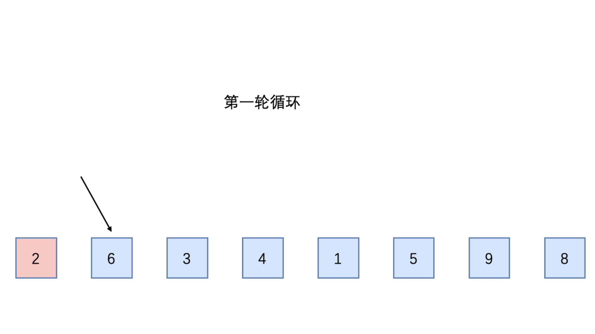
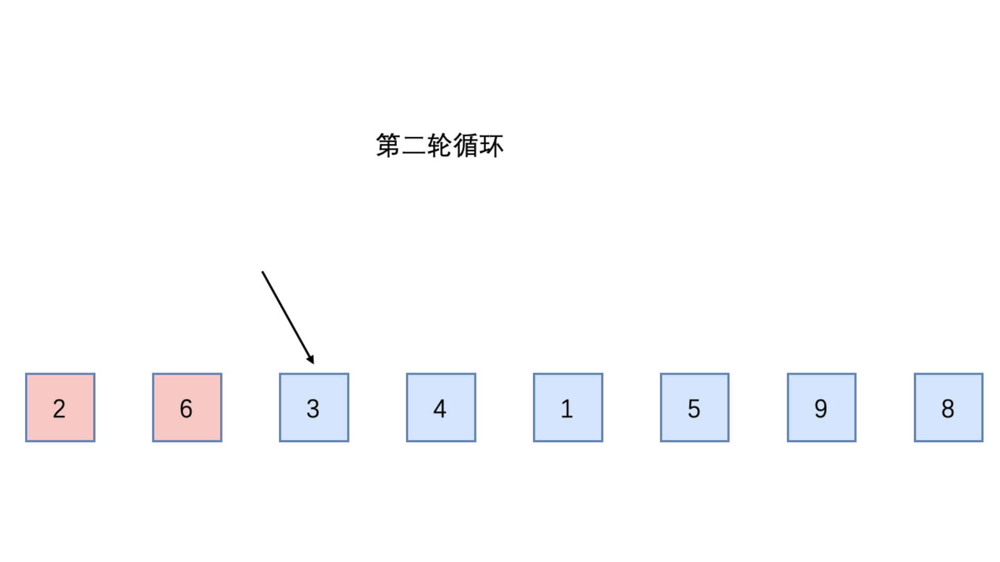
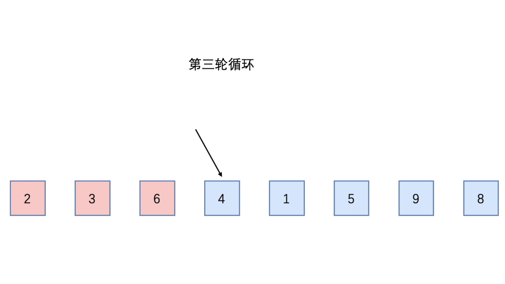
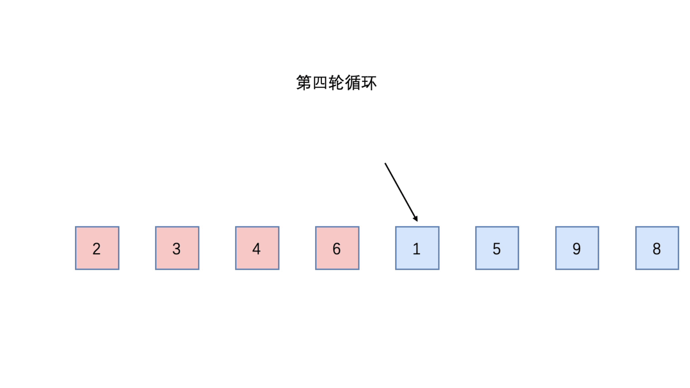
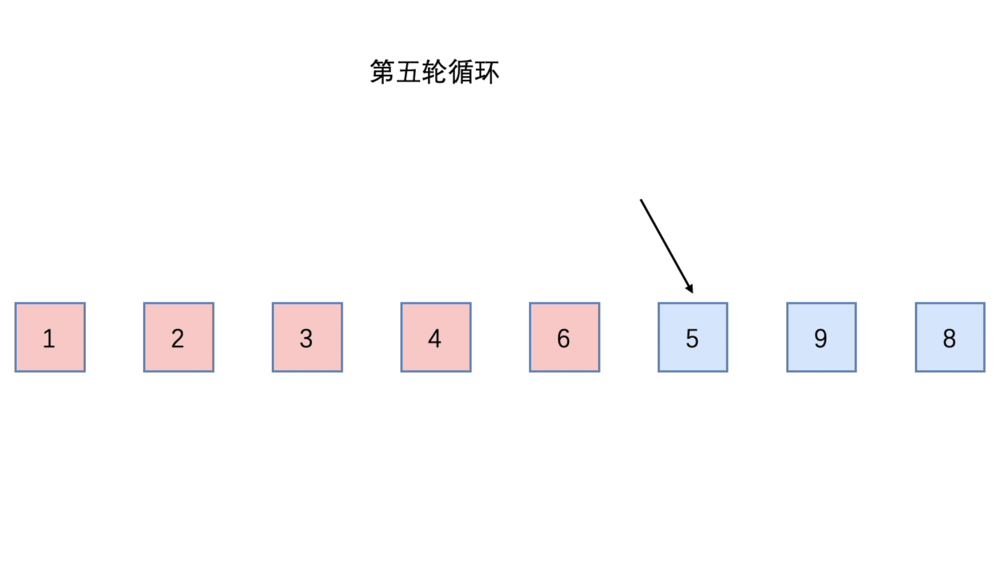
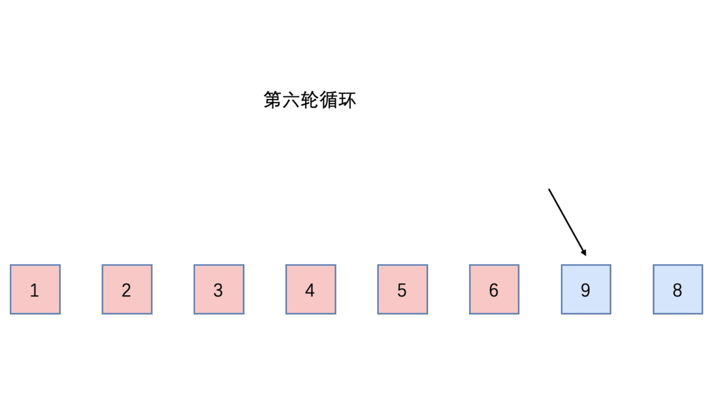
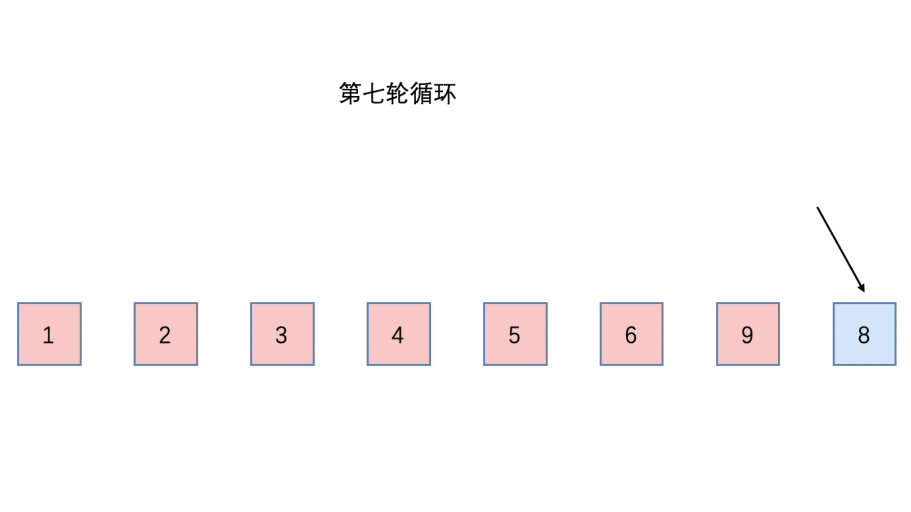

### 插入排序（Insert Sort）

插入排序也属于内部排序法，对需要排序的元素以插入的方式寻找该元素适当的位置，以达到排序的目的

基本思想：

- 将n个待排序的元素看成一个有序表和无序表
- 开始时有序表只有一个元素，无序表中有 n - 1 个元素
- 排序过程中每次从无序表中取出第一个元素，依次与有序表中的元素进行比较，将这个元素插入到有序表中适当的位置

插入排序时间复杂度：O(n²)


#### 分析

插入排序一共有 **数组长度 - 1 次** 排序，因为数组第一个元素作为有序表的一个元素，因为不需要判断

每一轮循环，和当前元素的前面的元素进行比较

- 当前面的元素大于当前元素时，前面的元素后移一位
- 接着继续和前面的元素进行比较，当前面的元素小于当前元素或者下标小于0时则插入到适当的位置中


##### 第一次循环



##### 第二次循环



##### 第三次循环



##### 第四次循环



##### 第五次循环



##### 第六次循环



##### 第七次循环



#### 代码实现

```java
public class InsertSort {

    public static void main(String[] args) {
        int[] arr = {2, 6, 3, 4, 1, 5, 9, 8};

        System.out.println("排序前：" + Arrays.toString(arr));

        // 第一层循环：用于确定循环的次数，由于第一个元素作为有序表中的第一个元素，那么则不需要循环比较
        // 所有循环次数为：arr.length - 1
        for (int i = 0; i < arr.length - 1; i++) {
            // 获取无序表中第一个元素
            int insertVal = arr[i + 1];
            // 获取无序表中第一个元素的前一个元素的位置下标
            int preIndex = i;

            // 循环比较前一个元素
            // 判断下标大于等于0时，并且插入的元素（即无序表中第一个元素）比前一个元素要小
            // 那么则将前一个元素的位置后移一位
            while (preIndex >= 0 && insertVal < arr[preIndex]){
                // 前一个元素后移一位
                arr[preIndex + 1] = arr[preIndex];
                // 前一个元素下标往前移动
                preIndex--;
            }
            // 将插入的元素放置适当的位置
            arr[preIndex + 1] = insertVal;
        }

        System.out.println("排序后：" + Arrays.toString(arr));
    }
}
```


####  事后统计方法测试速度

```java
public class TestInsertSpeed {

    public static void main(String[] args) {
        int[] arr = new int[80000];

        for (int i = 0; i < 80000; i++) {
            arr[i] = (int)(Math.random() * 80000);
        }

        SimpleDateFormat format = new SimpleDateFormat("HH:mm:ss");
        String beforeTime = format.format(new Date());
        System.out.println("执行前时间：" + beforeTime); // 09:22:30

        TestInsertSpeed.insert(arr);

        String afterTime = format.format(new Date());
        System.out.println("执行后时间：" + afterTime); // 09:22:31
    }

    public static int[] insert(int[] arr){
        for (int i = 0; i < arr.length - 1; i++) {
            int insertVal = arr[i + 1];
            int preIndex = i;

            while (preIndex >= 0 && insertVal < arr[preIndex]){
                arr[preIndex + 1] = arr[preIndex];
                preIndex--;
            }
            arr[preIndex + 1] = insertVal;
        }
        return arr;
    }
}
```

