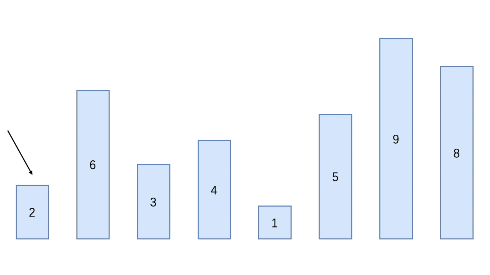
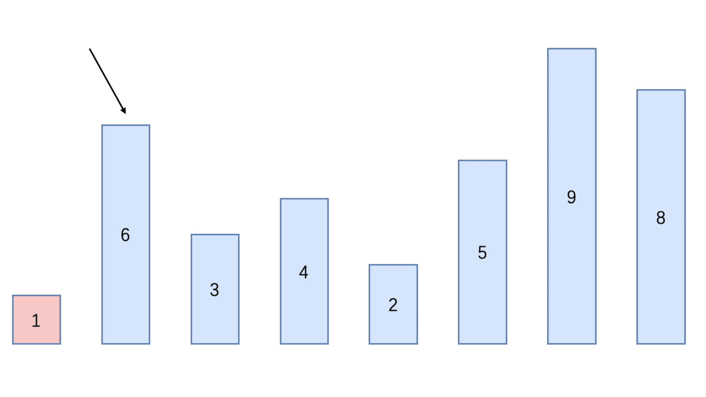
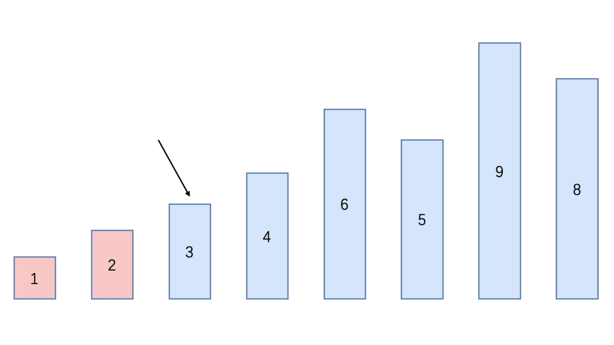
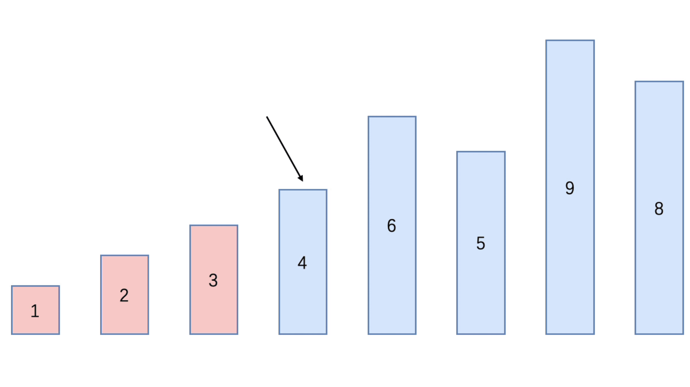
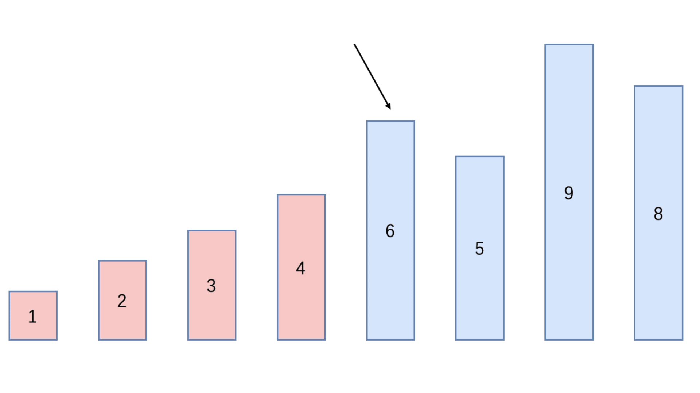
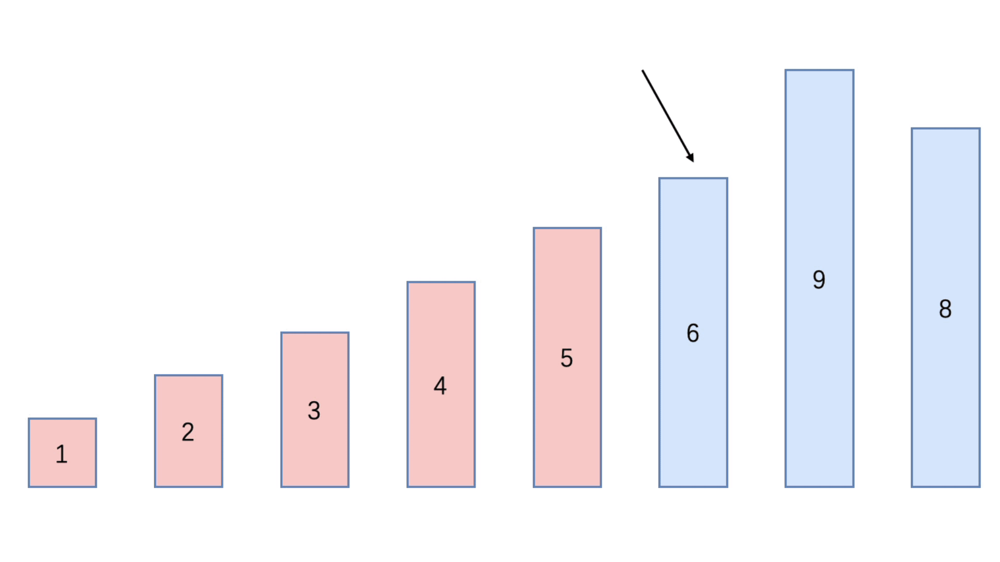
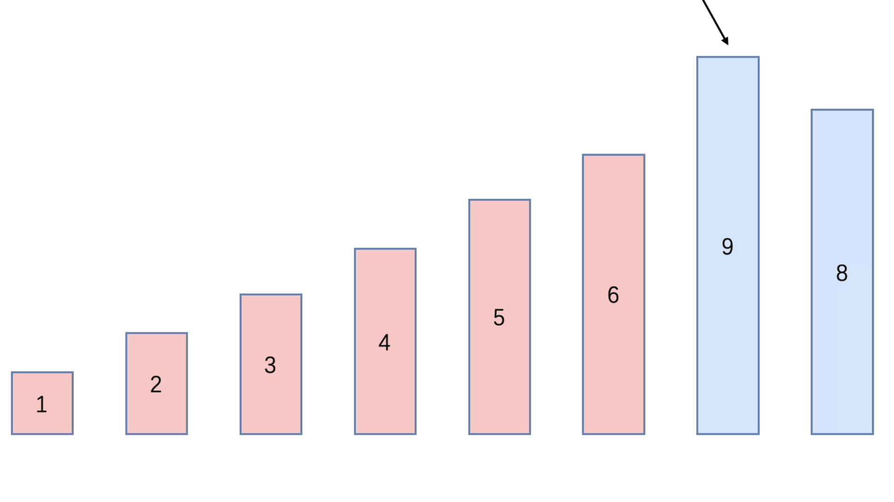

### 选择排序（Select Sorting）

选择排序属于内部排序

从需要排序的数据中，按照指定的规则选出某一个元素，再按照规定交换位置后即可达到排序的目的

选择排序基本思想：

- 第一次排序从下标0 ~ (n -1) 中选取最小值，接着与下标0的元素进行交换
- 第二次排序从下标1 ~ (n -1) 中选取最小值，接着与下标1的元素进行交换
- 第i次排序从下标 (i - 1) ~ (n -1) 中选取最小值，与下标 (i - 1) 的元素进行交换
- 总共进行 (n -1) 次排序，排序完后，会得到一个从小到大排序的序列

选择排序时间复杂度：O(n²)


#### 分析

选择排序一共有 **数组大小 - 1** 次排序，因为最后一个元素不用进行排序，已经是数组中最大的一个元素了

每一轮循环，和当前元素后面的所有元素进行比较

- 先假定当前元素是最小值
- 接着和后面的每个元素进行比较，如果有元素比当前元素小，则记录这个元素为最小值并得到这个元素的下标
- 当所有元素比较完后，则得到本轮循环的最小值和下标
- 接着将当前和本轮循环得到的最小指交换位置


##### 第一次循环



##### 第二次循环



##### 第三次循环



##### 第四次循环



##### 第五次循环



##### 第六次循环



##### 第七次循环



#### 代码实现

```java
public class SelectSort {

    public static void main(String[] args) {
        int[] arr = {2, 6, 3, 4, 1, 5, 9, 8};

        System.out.println("数组排序前：" + Arrays.toString(arr));

        // 第一层循环：用于确定循环次数
        for (int i = 0; i < arr.length - 1; i++) {
            int minIndex = i;
            int min = arr[i];

            // 第二层循环：用于每一轮循环所比较元素大小的次数
            for (int j = i + 1; j < arr.length; j++) {
                if (min > arr[j]){
                    minIndex = j;
                    min = arr[j];
                }
            }

            // 交换元素的位置
            arr[minIndex] = arr[i];
            arr[i] = min;
        }

        System.out.println("数组排序后：" + Arrays.toString(arr));
    }
}
```


#### 事后统计方法测试速度

```java
public class TestSelectSpeed {

    public static void main(String[] args) {
        int[] arr = new int[80000];

        for (int i = 0; i < 80000; i++) {
            arr[i] = (int)(Math.random() * 80000);
        }

        SimpleDateFormat format = new SimpleDateFormat("HH:mm:ss");
        String beforeTime = format.format(new Date());
        System.out.println("执行前时间：" + beforeTime); // 20:39:53

        TestSelectSpeed.select(arr);

        String afterTime = format.format(new Date());
        System.out.println("执行后时间：" + afterTime); // 20:39:57
    }

    public static int[] select(int[] arr){
        for (int i = 0; i < arr.length - 1; i++) {
            int minIndex = i;
            int min = arr[i];

            for (int j = i + 1; j < arr.length; j++) {
                if (min > arr[j]){
                    minIndex = j;
                    min = arr[j];
                }
            }

            arr[minIndex] = arr[i];
            arr[i] = min;
        }

        return arr;
    }
}
```

执行前时间：20:39:53

执行后时间：20:39:57