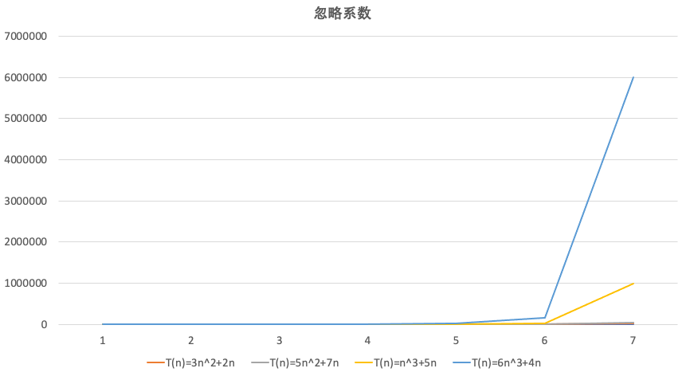

### 算法时间复杂度

度量一个程序（即算法）执行所需时间的两种方法

- 事后统计方法，这种方法可行，但是会出现两个问题：
  - 想要对设计的算法的运行性能进行评测，需要实际运行该程序
  - 所得的时间的统计量依赖于计算机硬件、软件等因素，即要想测试算法，要求在同一台计算机的相同状态下，才能比较哪个算法速度快
- 事前估算方法：通过分析某个算法的时间复杂度来判断哪个算法更优


#### 时间频度

时间频度：指一个算法所花费的时间与算法中语句的次数成正比，哪个算法的语句执行的次数多，那么它所花费的时间就越多。所以，**一个算法中语句执行的次数称为语句频度或者时间频度，记为：T(n)**

例如：计算1-100的所有数字之和，设计以下两种算法：

- 算法一

  ```java
  public void sum(){
    int total = 0;
    int end = 100;
    for (int i = 1; i <= end; i++) {
      total += i;
    }
  }
  ```

- 算法二

  ```java
  public void sum(){
    int end = 100;
    int total = (1 + end) * end / 2;
  }
  ```

此时，两个算法的时间频度为：

- 算法一的时间频度为：**T(n) = n + 1**，由于需要循环100次，记作n，并且循环完后，需要判断i是否大于end，所以需要 + 1
- 算法二的时间频度为：**T(n) = 1**


##### 忽略常数项


 

如上面两张图，可以得出：

- 2n+20 和 2n随着n变大，执行的曲线无限接近，所以20可以忽略
- 3n+10 和 3n随着n变大，执行的曲线无限接近，所以10可以忽略


##### 忽略低次项


如上面两张图，可以得出：

- 2n^2+3n+10 和 2n^2随着n变大，执行的曲线无限接近，那么低次项3n+10可以忽略
- n^2+5n+20 和 n^2随着n变大，执行的曲线无限接近，那么低次项5n+20可以忽略


##### 忽略系数




如上面两张图，可以得出：

- 随着n的增大，3n^2+2n 和 5n^2+7n，执行的曲线重合，那么系数3 和 5可以忽略
- 而n^3+5n 和 6n^3+4n，执行的曲线逐渐分离，这说明多少次方是关键


#### 时间复杂度

一般情况下，算法中的基本操作语句的重复执行次数是问题规模n的某个函数，用T(n)表示

若有某个辅助函数f(n)，使得当n接近无穷大时，T(n) / f(n)的极限值为不等于0的常数，则称f(n)是T(n)的同数量级函数，记作T(n)=O(f(n))，为算法的渐进时间复杂度，简称时间复杂度


虽然T(n)不同，但是时间复杂度可能是相同的，如：**T(n)=n^2+7n+6** 和 **T(n)=3n^2+2n+2**，它们的T(n)都不相同，但是时间复杂度是相同的，都是T(n)


计算时间复杂度的方法：

- 用常数1代替运行时间中的所有加法常数，例如：**T(n)=3n^2+2n+2** ==> **T(n)=3n^2+2n+1**
- 修改后的运行次数函数中，只保留最高阶项，例如： **T(n)=3n^2+2n+1** ==> **T(n)=3n^2**
- 去除最高阶项的系数，例如：**T(n)=3n^2** ==> **T(n)=n^2** ==> **T(n)=O(n^2)**


#### 常见的时间复杂度

常见的时间复杂度有八个：

- 常数阶：O(1)
- 对数阶：O(log₂n)
- 线性阶：O(n)
- 线性对数阶：O(nlog₂n)
- 平方阶：O(n²)
- 立方阶：O(n³)
- k次方阶：O(nᴷ)
- 指数阶：O(2ⁿ)【尽量避免】


常见时间复杂度从小到大依次：**O(1)** < **O(log₂n)** < **O(n)** < **O(nlog₂n)** < **O(n²)** < **O(n³)** < **O(nᴷ)** < **O(2ⁿ)**

**注意：时间复杂度越大，算法的执行效率越低**


##### 1）常见时间复杂度：O(1)

无论代码执行了多少行，只要没有循环等复杂结果，那么这个代码的时间复杂度就是O(1)

```java
int i = 1;
int j = 2;
++i;
j--;
int m = i + j;
```

如以上代码执行的时候，消耗的时间并不是随着某个变量的增长而增长，无论这个程序的代码有多长，即使有几万几十万行，都可以用O(1)来表示它的时间复杂度


##### 2）常见时间复杂度：O(log₂n)

```java
int n = 100000;
int i = 1;
while (i < n){
  i = i * 2;
  System.out.println("n = " + i);
}
```

以上代码，在循环时，每次将i * 2，乘完后，i 就距离n越来越近，假设执行x次后，i大于n了，那么这个循环就退出了

也就是说，2的x次方等于n，那么当循环log₂n次后就会结束，因此时间复杂度为O(log₂n)

**注意：O(log₂n)中的2是根据代码的变化而改变的，例如：上述代码修改为i = i * 3，那么时间复杂度就为O(log₃n)**


##### 3）常见时间复杂度：O(n)

```java
int n = 10000;
for (int i = 0; i < n; i++) {
  System.out.println("n = " + n);
}
```

以上代码，循环中的代码会执行n遍，消耗的时间是根据n的变化而变化的，因此这类的代码使用O(n)来表示它的时间复杂度


##### 4）常见时间复杂度：O(nlog₂n)

```java
int n = 1000;
for (int i = 0; i < n; i++) {
  int j = 1;
  while (j < n){
    j = j * 2;
    System.out.println("i = " + i + "，j = " + j);
  }
}
```

O(nlog₂n)其实就是将时间复杂度为O(log₂n)的代码循环n次，那么时间复杂度就为：n * O(log₂n)，即O(nlog₂n)


##### 5）常见时间复杂度：O(n²)、O(n³)和O(nᴷ)

```java
int n = 100;
for (int i = 0; i < n; i++) {
  for (int j = 0; j < n; j++) {
    System.out.println("i = " + i + "，j = " + j);
  }
}
```

O(n²)其实就是将时间复杂度为O(n)的代码循环n次，那么时间复杂度就为：n * O(n)，即O(n²)

**注意：如果将其中一层的循环改成m次，那么时间复杂度为：O(n * m)**

时间复杂度为O(n³)和O(nᴷ)的代码，依次类推


#### 平均时间复杂度和最坏时间复杂度

平均时间复杂度：指所有可能的输入实例均以等概率出现的情况下，该算法所运行的时间

最坏时间复杂度：指最坏情况下的时间复杂度，一般情况下所讨论的时间复杂度都是在最坏情况下的时间复杂度，最坏时间复杂度是算法在任何输入实例上运行时间的界限，保证该算法的运行时间不会比最坏情况下所运行时间更长

