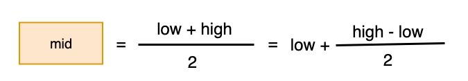
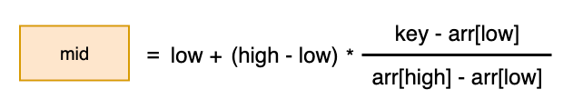

### 插值查找（Interpolation Search）

插值查找类似于二分查找，不同的是插值查找每次从 **自适应mid** 处开始查找

二分查找mid公式：



那么可以在二分查找的基础上进行改进，那么插值查找mid公式为：



**插值查找时间复杂度：log logN**


#### 适用范围

插值查找和二分查找的适用范围：

- 对于数据量较大，关键字分布比较均匀的顺序表来说，适用插值查找，速度较快，例如：{1,2,3,4,5,6,7,8,9,10} 和 {10, 20, 30, 40,  50, 60, 70, 80, 90, 100}这种顺序表
- 对于关键字分布不均匀的情况下，适用二分查找，此时的插值查找不一定比二分查找要好


#### 代码实现（递归）

```java
public class InterpolationSearchByRecursion {

    public static void main(String[] args) {
        int[] arr = {0, 10, 20, 30, 40, 50, 60, 70, 80, 90};

        // int[] arr = {1, 9, 16, 21, 33, 47, 81, 152};

        //int[] arr = new int[100];
        //for (int i = 0; i < 100; i++) {
        //    arr[i] = i + 1;
        //}
        //System.out.println("数组：" + Arrays.toString(arr));

        int index = interpolation(arr, 0, arr.length - 1, 70);
        System.out.println("查找到的索引为：" + index);
    }

    public static int interpolation(int[] arr, int start, int end, int searchVal) {
        if (start > end || searchVal < arr[0] || searchVal > arr[arr.length - 1]) {
            return -1;
        }
        
        // 使用插值查找的公式
        int mid = start + (end - start) * (searchVal - arr[start]) / (arr[end] - arr[start]);
        int midVal = arr[mid];

        if (searchVal > midVal){ // 中间值右边进行查找
            return interpolation(arr, mid + 1, end, searchVal);
        }else if (searchVal < midVal){ // 中间值左边进行查找
            return interpolation(arr, start, mid - 1, searchVal);
        }else { // 已经找到该值
            return mid;
        }
    }

}
```


#### 代码实现（非递归）

```java
public class InterpolationSearch {

    public static void main(String[] args) {
        int[] arr = {0, 10, 20, 30, 40, 50, 60, 70, 80, 90};

        // int[] arr = {1, 9, 16, 21, 33, 47, 81, 152};

        //int[] arr = new int[100];
        //for (int i = 0; i < 100; i++) {
        //    arr[i] = i + 1;
        //}
        //System.out.println("数组：" + Arrays.toString(arr));

        int index = interpolation(arr, 0, arr.length - 1, 152);
        System.out.println("查找到的索引为：" + index);
    }

    public static int interpolation(int[] arr, int start, int end, int searchVal) {

        if (start > end || arr[start] > searchVal || arr[end] < searchVal){
            return -1;
        }

        while (start <= end){
            int mid = start + (end - start) * (searchVal - arr[start]) / (arr[end] - arr[start]);
            if (arr[mid] < searchVal){ // 从中间值右边继续查找
                start = mid + 1;
            }else if (arr[mid] > searchVal){ // 从中间值左边继续查找
                end = mid - 1;
            }else { // 已经查找到该值
                return mid;
            }
        }
        return -1;
    }
}
```

