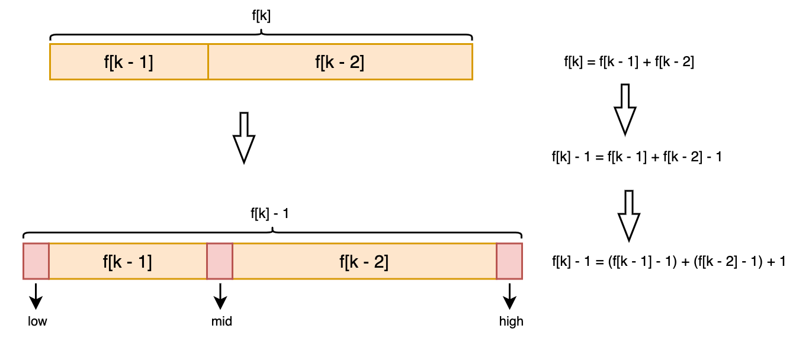

### 斐波那契查找（Fibonacci Search）

斐波那契查找，也称为黄金分割法

黄金分割，是指将整体一分为二，较大部分与整体部分的比值等于较小部分与较大部分的比值，其比值约为0.618。这个比例被公认为是最能引起美感的比例，因此被称为黄金分割

斐波那契查找时间复杂度：O(log₂n)


#### 斐波那契数列

斐波那契数列是指：{1, 1, 2, 3, 5, 8, 13, 21, 34, 55, 89, ...}这样一个数列，从第3项开始，每一项都等于前两项之和

斐波那契数列就与黄金分割紧密相关（0.618），两个相邻数的比例无限接近与黄金分割数

斐波那契数列公式：F (k) = F (k - 1) + F (k - 2)（k >= 2, *k* ∈ N*）

斐波那契查找分割时，分割后的两段就会呈现出黄金分割的特点


由斐波那契数列公式  (k) = F (k - 1) + F (k - 2)（k >= 2, *k* ∈ N*），可以得到 F (k) - 1 = (F (k - 1) - 1) + (F (k - 2) - 1)


#### 思路分析

##### 创建斐波那契数列

当需要按照斐波那契数列{1, 1, 2, 3, 5, 8, 13, 21}进行分割时，需要创建一个容纳了斐波那契数列的数组，长度大于或者等于查找数组长度的最小值即可

> 例如：查找的数组长度为9，那么斐波那契数列取到13即可，即长度为7


##### 创建填充数组

另外待查找数组的长度不可能总是满足斐波那契数列，例如：5，8，13等数字都是斐波那契数列中的值，但是，待查找数组长度可能为6，7，10这些不是斐波那契数列中的值，那么这时待查找数组的长度就不等于斐波那契数列的值了，那么这时需要新创建一个填充数组，长度为上面创建的斐波那契数列中的最大值，将待查找数组中的元素全部填充下去，剩余的位置用待查找数组中的最大值全部填充


当进行查找操作时，不是在原先待查找数组中进行查找，而是在填充数组中进行查找


##### 确定中间值

斐波那契查找与二分查找和插值查找类似，都是不断缩小搜索区间，进而确定目标值的位置

每次分割的中间位置计算公式如下：


此时填充数组被分割成两个区间：左边区间含有f ( k - 1 ) 个元素，右边区间含有 f ( k - 2 ) 个元素

> -1是因为下标从0开始，例如：f (1) 表示有两个元素、f (2)表示有三个元素


每次分割的中间位置公式演变：




##### 查找元素

中间值和目标值有三种大小关系：

- 中间值大于目标值：说明目标值位于左区间（即开始位置和中间值之间），由于左边区间含有f ( k - 1 ) 个元素，所以k 应该修改为k = k - 1
- 中间值小于目标值：说明目标值位于右区间（即中间位置和结束位置之间），右边区间含有 f ( k - 2 ) 个元素，所以k 应该修改为k = k - 2
- 中间值等于目标值：说明已经查找成功，返回对应下标即可


#### 代码实现

```java
public class FibonacciSearch {

    public static void main(String[] args) {
        int[] arr = {1, 9, 16, 21, 33, 47, 81, 152};
        fibonacciSearch(arr,81);
    }

    public static int fibonacciSearch(int[] arr, int searchVal){
        // 开始位置
        int low = 0;
        // 结束位置
        int high = arr.length - 1;
        // 斐波那契数列数组的下标
        int k = 0;
        // 获取斐波那契数列
        int[] fib = fibonacci(arr);

        // 获取斐波那契数列数值的下标
        while (high > fib[k] - 1){
            k++;
        }

        // 创建填充数组
        int[] temp = Arrays.copyOf(arr, fib[k]);
        // 将待查找数组的最大值填充到剩余的位置
        for (int i = high + 1; i < temp.length; i++) {
            arr[i] = arr[high];
        }

        int mid = 0;
        // 查找元素
        while (low <= high){
            // 获取中间值
            mid = low + fib[k - 1] - 1;

            // 判断中间值和目标值的关系
            if (searchVal < temp[mid]){ // 目标值小于中间值，说明目标值在左区间
                high = mid - 1;
                k--;
            }else if (searchVal > temp[mid]){ // 目标值大于中间值，说明目标值在右区间
                low = mid + 1;
                k -= 2;
            }else { // 说明找到了
                // 判断是否超出原先数组的长度，即是否取到填充数组的重复元素
                if (mid > high){ // 超过原先数组的长度，即取到了原先数组的重复元素
                    return high;
                }else {     // 没有超过原先数组的长度，即没有取到原先数组的重复元素
                    return mid;
                }
            }
        }
        return -1;
    }

    /**
     * 生成斐波那契数列
     * @param arr 待查找的数组
     * @return int[] 斐波那契数列
     */
    private static int[] fibonacci(int[] arr){
        int[] f = new int[arr.length];
        f[0] = 1;
        f[1] = 1;
        for (int i = 2; i < f.length; i++) {
            f[i] = f[i - 1] + f[i - 2];
        }
        return f;
    }
}
```

