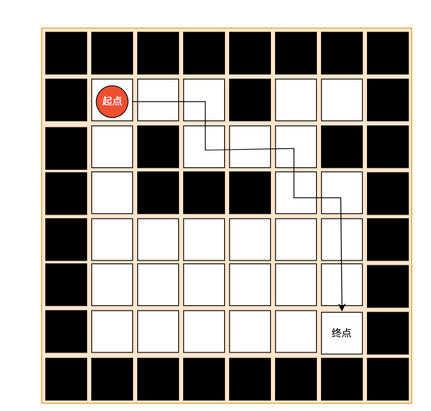
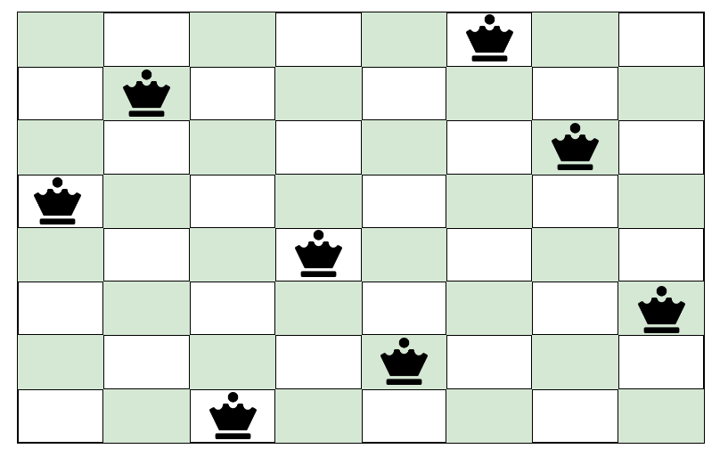

### 递归（Recursion）

递归，简单的说就是方法自己调用自己，每次调用时传入不同的变量

递归有助于编程者解决复杂的问题，同时可以让代码变得更加简洁


#### 递归解决的问题

- 各种数学问题：八皇后问题、汉诺塔、阶乘问题、迷宫问题、球和篮子问题（Google编程大赛中的题目）
- 各种算法中也会用到算法，例如：快速排序、归并排序、二分查找、分治算法等
- 用栈解决的问题，用递归解决比较简洁


#### 递归遵循的规则

- 执行一个方法时，创建一个新的受保护的独立空间（栈空间）
- 方法的局部变量是独立的，不会相互影响
- 如果方法中使用的是引用变量，就会共享该引用变量的数据
- 递归必须向退出递归的条件逼近，否则就是无限递归，相当于死循环，并且出现StackOverflowError
- 当一个方法执行完毕，或这遇到return语句，就会返回，遵循谁调用，就将结果返回给谁，同时当方法执行完毕或者遇到返回时，该方法就执行完毕


#### 实际案例：迷宫问题

给定一个迷宫，指明起点和终点，找出从起点出发到终点的有效可行路径，就是迷宫问题



约定：

- 0：表示没有走过的路
- 1：表示墙
- 2：表示这条路可以走
- 3：表示这条路已经走过，但是走不通

策略：按照下 右 上 左的顺序寻找迷宫的通道

##### 代码实现

```java
public class MiGong {
    public static void main(String[] args) {
        // 创建二维数组，模拟迷宫
        int[][] map = new int[8][7];

        // 创建墙，表示不能越过墙的位置
        for (int i = 0; i < 7; i++) {
            map[0][i] = 1;
            map[7][i] = 1;
        }
        for (int i = 0; i < 8; i++) {
            map[i][0] = 1;
            map[i][6] = 1;
        }

        // 设置挡板
        map[3][1] = 1;
        map[3][2] = 1;

        for (int[] rows : map) {
            for (int col : rows) {
                System.out.print(col + "\t");
            }
            System.out.println();
        }

        setWay(map, 1, 1);

        System.out.println("=========================================");

        for (int[] rows : map) {
            for (int col : rows) {
                System.out.print(col + "\t");
            }
            System.out.println();
        }
    }


    /**
     * 寻找迷宫通道
     *  0：表示没有走过的路
     *  1：表示墙
     *  2：表示这条路可以走
     *  3：表示这条路已经走过，但是走不通
     * 策略：先走下边，不通则右边，接着为上边和左边，如果四个方向都不通，则进行回溯
     * @param map 迷宫地图
     * @param i 开始位置x
     * @param j 开始位置y
     * @return boolean 如果找到则返回true，没有找到则返回false
     */
    public static boolean setWay(int[][] map, int i, int j){
        if (map[6][2] == 2){
            return true;
        }else {
            if (map[i][j] == 0){
                // 按照策略开始走 下 右 上 左
                map[i][j] = 2; // 假设该路可以走通，将该路设置为2
                if (setWay(map, i + 1, j)){
                    return true;
                }else if (setWay(map, i, j + 1)){
                    return true;
                }else if (setWay(map, i - 1, j)){
                    return true;
                }else if (setWay(map, i, j - 1)){
                    return true;
                }else {
                    // 如果下 右 上 左都不通，将该路设置为3
                    map[i][j] = 3;
                    return false;
                }
            }else { // 如果map[i][j] != 0, 那么可能为1，2，3
                return false;
            }
        }
    }
}
```


#### 实际问题：八皇后问题

八皇后问题，是计算机科学中最为经典的问题之一，由国际西洋棋棋手马克斯 贝瑟尔于1848年提出

八皇后问题，就是在**8*8**的国际象棋盘上**摆放八个皇后**，**使其不能相互攻击，任意的两个皇后都不能处于同一行、同一列或者同一斜线上**，然后求出有多少中摆放方法



##### 代码实现

```java
public class Queen {

    // 表示共有多少个皇后
    int max = 8;
    // 定义一个一维数组，用于保存皇后放置的位置
    int[] array = new int[max];
    // 用于记录八皇后问题的解法次数
    private static int count = 0;

    public static void main(String[] args) {
        Queen queen = new Queen();
        queen.check(0);

        System.out.println("共有：" + count + "次解法");
    }

    private void check(int n){
        // 判断是否已经到最后一个皇后
        if (n == max){
            print();
            System.out.println("-----------------------------------");
            return;
        }

        // 记录放置皇后的位置
        for (int i = 0; i < max; i++) {
            array[n] = i;
            if (judge(n)){
                check(n + 1);
            }
        }
    }

    // 检测该皇后是否和前面已经摆放的皇后冲突
    private boolean judge(int n){
        // 循环判断当前皇后的前面所有皇后是否在同一列、同一斜线上
        // 由于使用一维数组记录皇后的位置，所以不用判断任意皇后是否在同一行上
        for (int i = 0; i < n; i++) {
            // array[i] == array[n] 用于判断是否在同一列
            // Math.abs(n - i) == Math.abs(array[n] - array[i]) 用于判断是否在同一斜线上
            if (array[i] == array[n] || Math.abs(n - i) == Math.abs(array[n] - array[i])){
                return false;
            }
        }
        return true;
    }

    // 将皇后摆放的位置输出
    private void print(){
        count++;
        for (int i = 0; i < array.length; i++) {
            System.out.print(array[i] + "");
        }
        System.out.println();
    }
}
```

